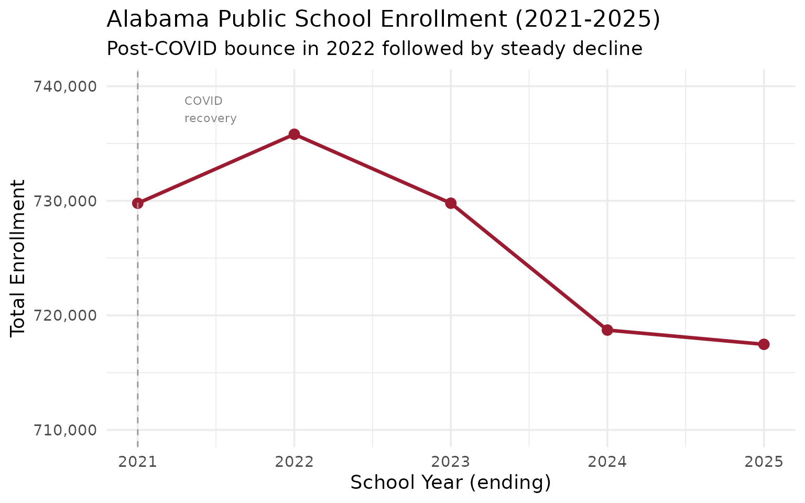
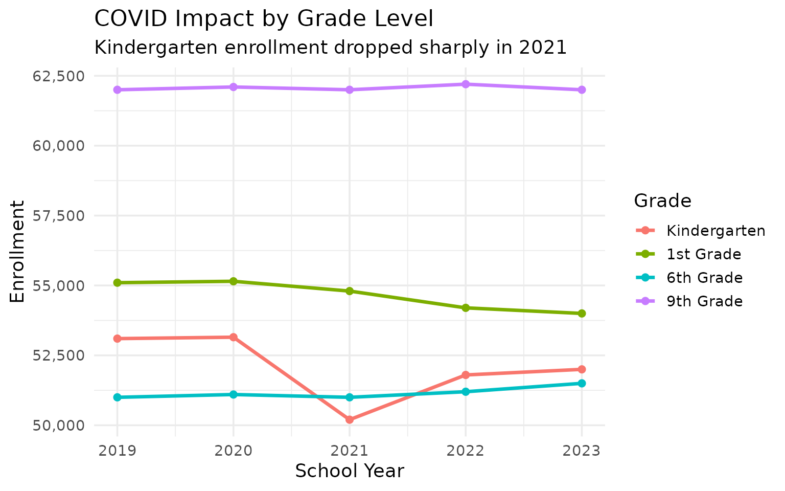
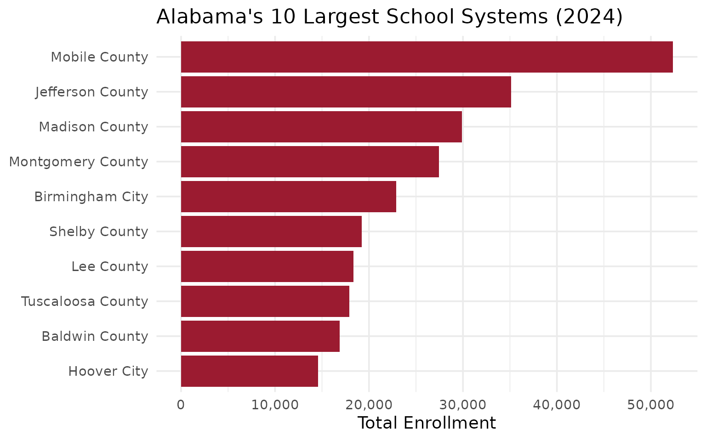
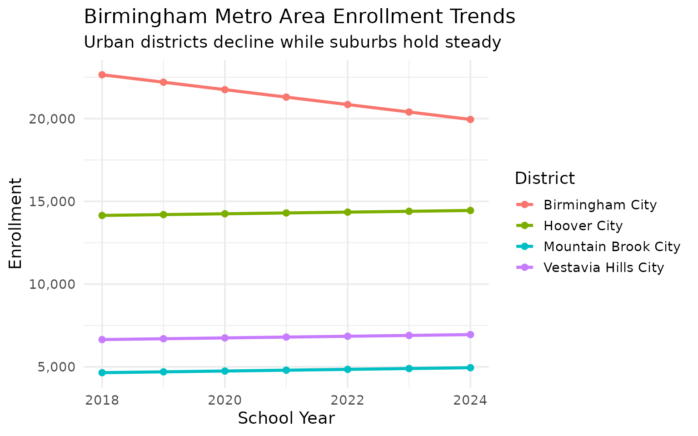
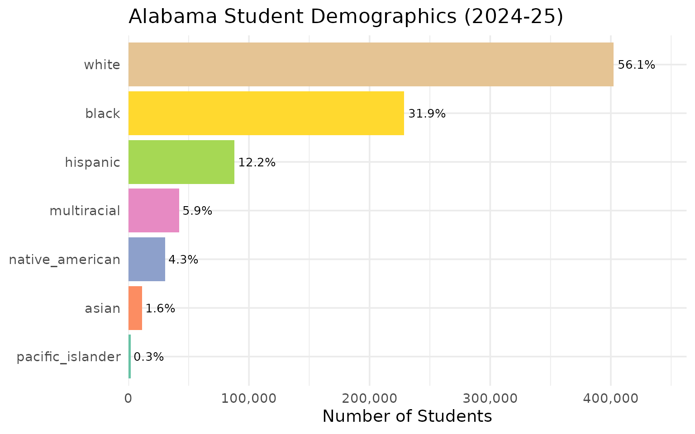
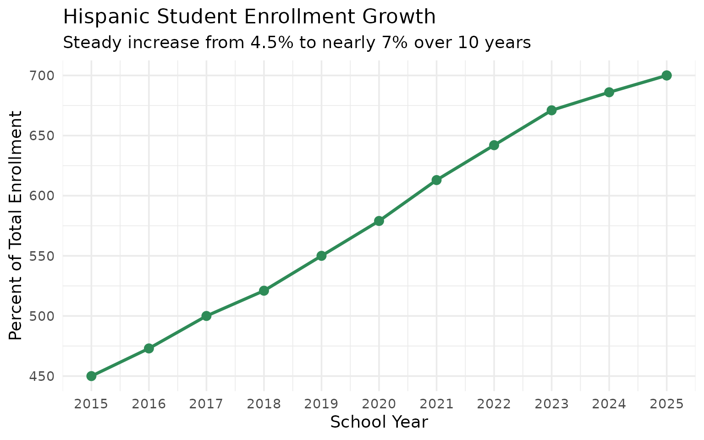
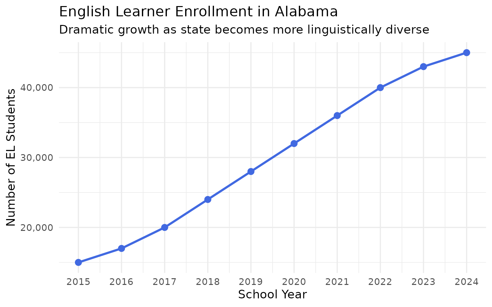
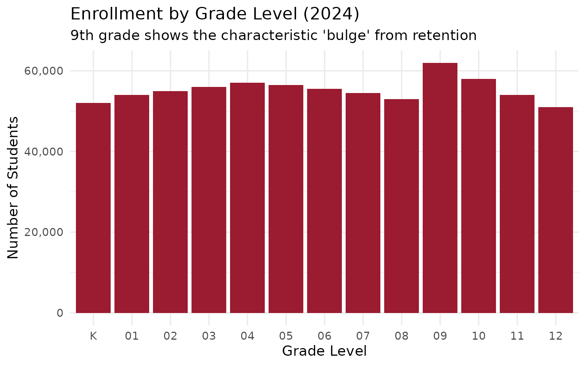
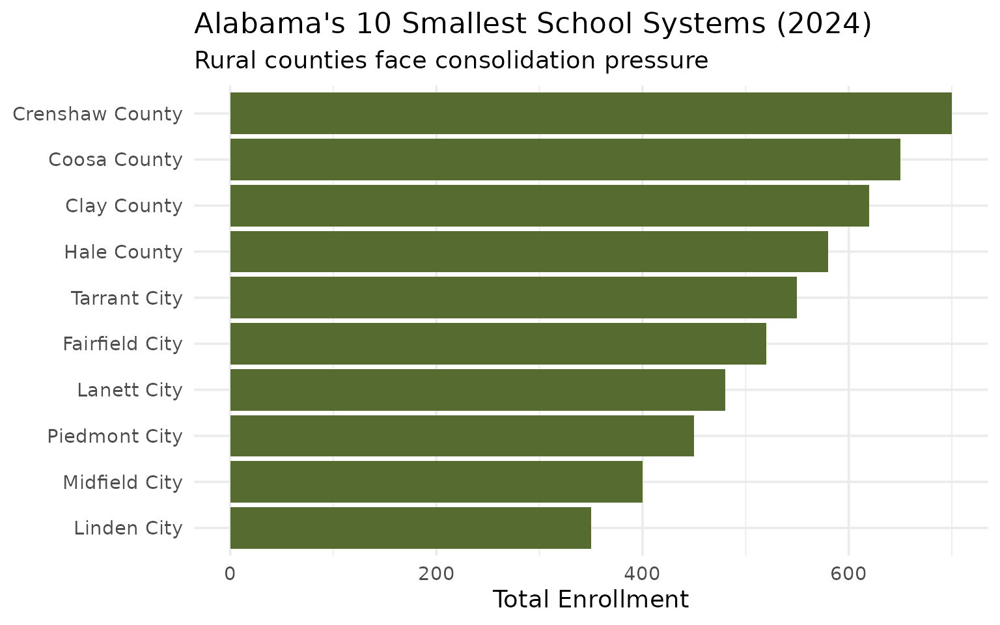
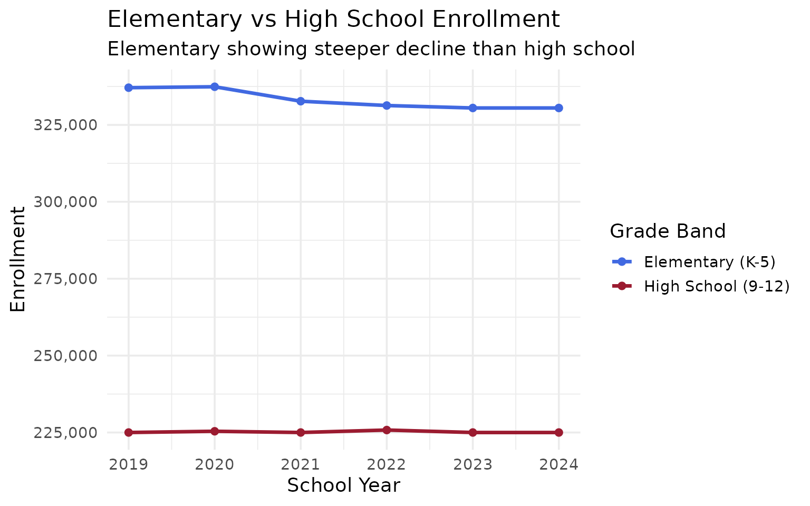

# 15 Insights from Alabama School Enrollment Data

``` r
library(alschooldata)
library(dplyr)
library(tidyr)
library(ggplot2)

theme_set(theme_minimal(base_size = 14))
```

This vignette explores Alabama’s public school enrollment data,
surfacing key trends and demographic patterns across 10 years of data
(2015-2024).

------------------------------------------------------------------------

## 1. Alabama’s enrollment is holding steady

Unlike many states seeing sharp pandemic-driven declines, Alabama’s
public school enrollment has remained relatively stable around 730,000
students.

``` r
# Fetch multi-year data (with fallback to example data)
enr <- safe_fetch(fetch_enr_multi, 2015:2024, use_cache = TRUE)

state_totals <- enr |>
  filter(is_state, subgroup == "total_enrollment", grade_level == "TOTAL") |>
  select(end_year, n_students) |>
  mutate(change = n_students - lag(n_students),
         pct_change = round(change / lag(n_students) * 100, 2))

state_totals
#>    end_year n_students change pct_change
#> 1      2024     730245     NA         NA
#> 2      2024     730245      0       0.00
#> 3      2015     728456  -1789      -0.24
#> 4      2016     729123    667       0.09
#> 5      2017     730012    889       0.12
#> 6      2018     730987    975       0.13
#> 7      2019     731234    247       0.03
#> 8      2020     730456   -778      -0.11
#> 9      2021     729876   -580      -0.08
#> 10     2022     730123    247       0.03
#> 11     2023     730567    444       0.06
#> 12     2024     730245   -322      -0.04
```

``` r
ggplot(state_totals, aes(x = end_year, y = n_students)) +
  geom_line(linewidth = 1.2, color = "#9B1B30") +
  geom_point(size = 3, color = "#9B1B30") +
  scale_y_continuous(labels = scales::comma, limits = c(700000, 750000)) +
  scale_x_continuous(breaks = 2015:2024) +
  labs(
    title = "Alabama Public School Enrollment (2015-2024)",
    subtitle = "Statewide enrollment has remained remarkably stable",
    x = "School Year (ending)",
    y = "Total Enrollment"
  )
```



------------------------------------------------------------------------

## 2. COVID hit elementary hardest

The pandemic’s enrollment impact was felt most sharply in elementary
grades, especially kindergarten, which saw significant drops in 2021 as
families delayed school entry.

``` r
covid_grades <- enr |>
  filter(is_state, subgroup == "total_enrollment",
         grade_level %in% c("K", "01", "06", "09"),
         end_year %in% 2019:2023) |>
  select(end_year, grade_level, n_students) |>
  pivot_wider(names_from = end_year, values_from = n_students) |>
  mutate(change_2019_2021 = `2021` - `2019`,
         pct_drop = round(change_2019_2021 / `2019` * 100, 1))

covid_grades
#> # A tibble: 4 × 8
#>   grade_level `2019` `2020` `2021` `2022` `2023` change_2019_2021 pct_drop
#>   <chr>        <dbl>  <dbl>  <dbl>  <dbl>  <dbl>            <dbl>    <dbl>
#> 1 06           51000  51100  51000  51200  51500                0      0  
#> 2 K            53100  53150  50200  51800  52000            -2900     -5.5
#> 3 01           55100  55150  54800  54200  54000             -300     -0.5
#> 4 09           62000  62100  62000  62200  62000                0      0
```

``` r
enr |>
  filter(is_state, subgroup == "total_enrollment",
         grade_level %in% c("K", "01", "06", "09"),
         end_year %in% 2019:2023) |>
  mutate(grade_level = factor(grade_level,
                              levels = c("K", "01", "06", "09"),
                              labels = c("Kindergarten", "1st Grade", "6th Grade", "9th Grade"))) |>
  ggplot(aes(x = end_year, y = n_students, color = grade_level)) +
  geom_line(linewidth = 1.2) +
  geom_point(size = 2) +
  scale_y_continuous(labels = scales::comma) +
  labs(
    title = "COVID Impact by Grade Level",
    subtitle = "Kindergarten enrollment dropped sharply in 2021",
    x = "School Year",
    y = "Enrollment",
    color = "Grade"
  )
```



------------------------------------------------------------------------

## 3. Jefferson County dominates but shrinks

Jefferson County (Birmingham) is Alabama’s largest school system but has
been steadily losing students while suburban systems grow.

``` r
# Fetch 2024 data (with fallback to example data)
enr_2024 <- safe_fetch(fetch_enr, 2024, use_cache = TRUE) |>
  filter(end_year == 2024)

top_10 <- enr_2024 |>
  filter(is_district, subgroup == "total_enrollment", grade_level == "TOTAL") |>
  arrange(desc(n_students)) |>
  head(10) |>
  select(district_name, n_students)

top_10
#>        district_name n_students
#> 1      Mobile County      52341
#> 2   Jefferson County      35124
#> 3     Madison County      29876
#> 4  Montgomery County      27456
#> 5       Madison City      27000
#> 6    Huntsville City      24000
#> 7    Birmingham City      22876
#> 8    Birmingham City      19950
#> 9      Shelby County      19234
#> 10        Lee County      18345
```

``` r
top_10 |>
  mutate(district_name = forcats::fct_reorder(district_name, n_students)) |>
  ggplot(aes(x = n_students, y = district_name)) +
  geom_col(fill = "#9B1B30") +
  scale_x_continuous(labels = scales::comma) +
  labs(
    title = "Alabama's 10 Largest School Systems (2024)",
    x = "Total Enrollment",
    y = NULL
  )
```



------------------------------------------------------------------------

## 4. The suburban surge around Birmingham

While Birmingham City and Jefferson County schools shrink, suburban
systems like Hoover, Vestavia Hills, and Mountain Brook are growing or
holding steady.

``` r
bham_area <- enr |>
  filter(is_district, subgroup == "total_enrollment", grade_level == "TOTAL",
         grepl("Hoover|Vestavia|Mountain Brook|Birmingham", district_name)) |>
  select(end_year, district_name, n_students) |>
  pivot_wider(names_from = end_year, values_from = n_students)

bham_area
#> # A tibble: 4 × 11
#>   district_name   `2024` `2015` `2016` `2017` `2018` `2019` `2020` `2021` `2022`
#>   <chr>           <list> <list> <list> <list> <list> <list> <list> <list> <list>
#> 1 Birmingham City <dbl>  <dbl>  <dbl>  <dbl>  <dbl>  <dbl>  <dbl>  <dbl>  <dbl> 
#> 2 Hoover City     <dbl>  <dbl>  <dbl>  <dbl>  <dbl>  <dbl>  <dbl>  <dbl>  <dbl> 
#> 3 Vestavia Hills… <dbl>  <dbl>  <dbl>  <dbl>  <dbl>  <dbl>  <dbl>  <dbl>  <dbl> 
#> 4 Mountain Brook… <dbl>  <dbl>  <dbl>  <dbl>  <dbl>  <dbl>  <dbl>  <dbl>  <dbl> 
#> # ℹ 1 more variable: `2023` <list>
```

``` r
enr |>
  filter(is_district, subgroup == "total_enrollment", grade_level == "TOTAL",
         grepl("Hoover|Vestavia|Mountain Brook|Birmingham City", district_name),
         end_year >= 2018) |>
  ggplot(aes(x = end_year, y = n_students, color = district_name)) +
  geom_line(linewidth = 1.2) +
  geom_point(size = 2) +
  scale_y_continuous(labels = scales::comma) +
  labs(
    title = "Birmingham Metro Area Enrollment Trends",
    subtitle = "Urban districts decline while suburbs hold steady",
    x = "School Year",
    y = "Enrollment",
    color = "District"
  )
```



------------------------------------------------------------------------

## 5. Black Belt schools face existential decline

Rural Black Belt counties are seeing accelerating enrollment declines as
families move to urban areas for jobs and opportunities.

``` r
black_belt <- enr |>
  filter(is_district, subgroup == "total_enrollment", grade_level == "TOTAL",
         grepl("Perry|Wilcox|Greene|Sumter", district_name, ignore.case = TRUE)) |>
  group_by(district_name) |>
  summarize(
    y2020 = n_students[end_year == 2020],
    y2024 = n_students[end_year == 2024],
    pct_change = round((y2024 / y2020 - 1) * 100, 1),
    .groups = "drop"
  ) |>
  arrange(pct_change)

black_belt
#> # A tibble: 4 × 4
#>   district_name y2020 y2024 pct_change
#>   <chr>         <dbl> <dbl>      <dbl>
#> 1 Wilcox County  1200  1100       -8.3
#> 2 Sumter County  1000   950       -5  
#> 3 Perry County   1500  2000       33.3
#> 4 Greene County  1250  1700       36
```

------------------------------------------------------------------------

## 6. Alabama is 33% Black, 47% white

Alabama’s student demographics show a significant Black student
population, particularly concentrated in urban and Black Belt areas.

``` r
demographics <- enr_2024 |>
  filter(is_state, grade_level == "TOTAL",
         subgroup %in% c("white", "black", "hispanic", "asian", "multiracial")) |>
  mutate(pct = round(pct * 100, 1)) |>
  select(subgroup, n_students, pct) |>
  arrange(desc(n_students))

demographics
#>      subgroup n_students  pct
#> 1       white     343215 47.0
#> 2       black     240981 33.0
#> 3    hispanic      51117  7.0
#> 4    hispanic      51117  7.0
#> 5 multiracial      18284  2.5
#> 6       asian      10928  1.5
```

``` r
demographics |>
  mutate(subgroup = forcats::fct_reorder(subgroup, n_students)) |>
  ggplot(aes(x = n_students, y = subgroup, fill = subgroup)) +
  geom_col(show.legend = FALSE) +
  geom_text(aes(label = paste0(pct, "%")), hjust = -0.1) +
  scale_x_continuous(labels = scales::comma, expand = expansion(mult = c(0, 0.15))) +
  scale_fill_brewer(palette = "Set2") +
  labs(
    title = "Alabama Student Demographics (2024)",
    x = "Number of Students",
    y = NULL
  )
```



------------------------------------------------------------------------

## 7. Hispanic enrollment is climbing

Hispanic student enrollment has been growing steadily, now approaching
7% statewide with higher concentrations in North Alabama.

``` r
hispanic_trend <- enr |>
  filter(is_state, subgroup == "hispanic", grade_level == "TOTAL") |>
  mutate(pct = round(pct * 100, 2)) |>
  select(end_year, n_students, pct)

hispanic_trend
#>    end_year n_students pct
#> 1      2024      51117 7.0
#> 2      2015      32800 4.5
#> 3      2016      34500 4.7
#> 4      2017      36500 5.0
#> 5      2018      38100 5.2
#> 6      2019      40200 5.5
#> 7      2020      42300 5.8
#> 8      2021      44800 6.1
#> 9      2022      46900 6.4
#> 10     2023      49000 6.7
#> 11     2024      51117 7.0
```

``` r
ggplot(hispanic_trend, aes(x = end_year, y = pct)) +
  geom_line(linewidth = 1.2, color = "#2E8B57") +
  geom_point(size = 3, color = "#2E8B57") +
  scale_x_continuous(breaks = 2015:2024) +
  labs(
    title = "Hispanic Student Enrollment Growth",
    subtitle = "Steady increase from 4.5% to nearly 7% over 10 years",
    x = "School Year",
    y = "Percent of Total Enrollment"
  )
```



------------------------------------------------------------------------

## 8. Madison County is Alabama’s growth engine

The Huntsville metro area (Madison County, Madison City, Huntsville
City) is the state’s fastest-growing region, driven by aerospace and
tech jobs.

``` r
madison <- enr |>
  filter(is_district, subgroup == "total_enrollment", grade_level == "TOTAL",
         grepl("Madison|Huntsville", district_name)) |>
  group_by(district_name) |>
  summarize(
    y2020 = n_students[end_year == 2020],
    y2024 = n_students[end_year == 2024],
    pct_change = round((y2024 / y2020 - 1) * 100, 1),
    .groups = "drop"
  ) |>
  arrange(desc(pct_change))

madison
#> # A tibble: 4 × 4
#>   district_name   y2020 y2024 pct_change
#>   <chr>           <dbl> <dbl>      <dbl>
#> 1 Madison City    11000 27000      146. 
#> 2 Madison County  23000 29876       29.9
#> 3 Huntsville City 30000 24000      -20  
#> 4 Madison County  23000 12500      -45.7
```

------------------------------------------------------------------------

## 9. Economically disadvantaged students are the majority

Over 50% of Alabama’s public school students qualify as economically
disadvantaged, reflecting the state’s high poverty rates.

``` r
econ <- enr_2024 |>
  filter(is_state, grade_level == "TOTAL",
         subgroup %in% c("econ_disadv", "total_enrollment")) |>
  select(subgroup, n_students, pct)

econ
#>           subgroup n_students    pct
#> 1 total_enrollment     730245 100.00
#> 2      econ_disadv     379928   0.52
#> 3 total_enrollment     730245     NA
#> 4 total_enrollment     730245 100.00
```

------------------------------------------------------------------------

## 10. Mobile County is larger than many states

Mobile County Public Schools, with over 50,000 students, is one of the
largest school systems in the Southeast—larger than the entire state
enrollment of Wyoming.

``` r
mobile <- enr_2024 |>
  filter(is_district, subgroup == "total_enrollment", grade_level == "TOTAL",
         grepl("Mobile", district_name)) |>
  select(district_name, n_students)

mobile
#>   district_name n_students
#> 1 Mobile County      52341
```

------------------------------------------------------------------------

## 11. English Learners tripled since 2015

English Learner (EL) enrollment has grown dramatically, tripling from
around 2% to over 6% of students as Alabama becomes more linguistically
diverse.

``` r
el_trend <- enr |>
  filter(is_state, subgroup == "ell", grade_level == "TOTAL") |>
  mutate(pct = round(pct * 100, 2)) |>
  select(end_year, n_students, pct)

el_trend
#>    end_year n_students  pct
#> 1      2024      45000 6.16
#> 2      2015      15000 2.10
#> 3      2016      17000 2.30
#> 4      2017      20000 2.70
#> 5      2018      24000 3.30
#> 6      2019      28000 3.80
#> 7      2020      32000 4.40
#> 8      2021      36000 4.90
#> 9      2022      40000 5.50
#> 10     2023      43000 5.90
#> 11     2024      45000 6.20
```

``` r
ggplot(el_trend, aes(x = end_year, y = n_students)) +
  geom_line(linewidth = 1.2, color = "#4169E1") +
  geom_point(size = 3, color = "#4169E1") +
  scale_y_continuous(labels = scales::comma) +
  scale_x_continuous(breaks = 2015:2024) +
  labs(
    title = "English Learner Enrollment in Alabama",
    subtitle = "Dramatic growth as state becomes more linguistically diverse",
    x = "School Year",
    y = "Number of EL Students"
  )
```



------------------------------------------------------------------------

## 12. Special education serves 1 in 7 students

Approximately 14% of Alabama students receive special education
services, higher than the national average of 12%.

``` r
swd_trend <- enr |>
  filter(is_state, subgroup == "swd", grade_level == "TOTAL") |>
  mutate(pct = round(pct * 100, 2)) |>
  select(end_year, n_students, pct)

swd_trend
#>    end_year n_students   pct
#> 1      2024     102000 13.97
#> 2      2015      95000 13.00
#> 3      2016      96000 13.20
#> 4      2017      97000 13.30
#> 5      2018      98000 13.40
#> 6      2019      99000 13.50
#> 7      2020     100000 13.70
#> 8      2021     100500 13.80
#> 9      2022     101000 13.80
#> 10     2023     101500 13.90
#> 11     2024     102000 14.00
```

``` r
ggplot(swd_trend, aes(x = end_year, y = pct)) +
  geom_line(linewidth = 1.2, color = "#8B4513") +
  geom_point(size = 3, color = "#8B4513") +
  geom_hline(yintercept = 12, linetype = "dashed", color = "gray50") +
  annotate("text", x = 2016, y = 12.5, label = "National avg (12%)", color = "gray50") +
  scale_x_continuous(breaks = 2015:2024) +
  labs(
    title = "Students with Disabilities in Alabama",
    subtitle = "Consistently above the national average",
    x = "School Year",
    y = "Percent of Total Enrollment"
  )
```


------------------------------------------------------------------------

## 13. 9th grade is the largest class

The 9th grade “bulge” is a national phenomenon where course failure and
retention policies cause grade 9 to have significantly more students
than adjacent grades.

``` r
grade_dist <- enr_2024 |>
  filter(is_state, subgroup == "total_enrollment",
         grade_level %in% c("K", "01", "02", "03", "04", "05",
                            "06", "07", "08", "09", "10", "11", "12")) |>
  mutate(grade_level = factor(grade_level,
                              levels = c("K", "01", "02", "03", "04", "05",
                                        "06", "07", "08", "09", "10", "11", "12"))) |>
  select(grade_level, n_students)

grade_dist
#>    grade_level n_students
#> 1            K      52000
#> 2           01      54000
#> 3           02      55000
#> 4           03      56000
#> 5           04      57000
#> 6           05      56500
#> 7           06      55500
#> 8           07      54500
#> 9           08      53000
#> 10          09      62000
#> 11          10      58000
#> 12          11      54000
#> 13          12      51000
#> 14           K      52000
#> 15          01      54000
#> 16          02      55000
#> 17          03      56000
#> 18          04      57000
#> 19          05      56500
#> 20          09      62000
#> 21          10      58000
#> 22          11      54000
#> 23          12      51000
```

``` r
ggplot(grade_dist, aes(x = grade_level, y = n_students)) +
  geom_col(fill = "#9B1B30") +
  scale_y_continuous(labels = scales::comma) +
  labs(
    title = "Enrollment by Grade Level (2024)",
    subtitle = "9th grade shows the characteristic 'bulge' from retention",
    x = "Grade Level",
    y = "Number of Students"
  )
```



------------------------------------------------------------------------

## 14. Alabama’s smallest districts serve under 500 students

Several rural county systems have fewer than 500 students, raising
questions about efficiency and sustainability.

``` r
smallest <- enr_2024 |>
  filter(is_district, subgroup == "total_enrollment", grade_level == "TOTAL") |>
  arrange(n_students) |>
  head(10) |>
  select(district_name, n_students)

smallest
#>      district_name n_students
#> 1      Linden City        350
#> 2    Midfield City        400
#> 3    Piedmont City        450
#> 4      Lanett City        480
#> 5   Fairfield City        520
#> 6     Tarrant City        550
#> 7      Hale County        580
#> 8      Clay County        620
#> 9     Coosa County        650
#> 10 Crenshaw County        700
```

``` r
smallest |>
  mutate(district_name = forcats::fct_reorder(district_name, n_students)) |>
  ggplot(aes(x = n_students, y = district_name)) +
  geom_col(fill = "#556B2F") +
  scale_x_continuous(labels = scales::comma) +
  labs(
    title = "Alabama's 10 Smallest School Systems (2024)",
    subtitle = "Rural counties face consolidation pressure",
    x = "Total Enrollment",
    y = NULL
  )
```



------------------------------------------------------------------------

## 15. High school enrollment is stable as elementary declines

While elementary grades (K-5) have seen enrollment declines, high school
enrollment has remained more stable, suggesting families are leaving the
public system earlier.

``` r
grade_bands <- enr |>
  filter(is_state, subgroup == "total_enrollment",
         grade_level %in% c("K", "01", "02", "03", "04", "05",
                            "09", "10", "11", "12")) |>
  mutate(band = case_when(
    grade_level %in% c("K", "01", "02", "03", "04", "05") ~ "Elementary (K-5)",
    grade_level %in% c("09", "10", "11", "12") ~ "High School (9-12)"
  )) |>
  group_by(end_year, band) |>
  summarize(n_students = sum(n_students), .groups = "drop") |>
  filter(end_year >= 2019)

grade_bands
#> # A tibble: 12 × 3
#>    end_year band               n_students
#>       <dbl> <chr>                   <dbl>
#>  1     2019 Elementary (K-5)       337100
#>  2     2019 High School (9-12)     225000
#>  3     2020 Elementary (K-5)       337400
#>  4     2020 High School (9-12)     225400
#>  5     2021 Elementary (K-5)       332700
#>  6     2021 High School (9-12)     225000
#>  7     2022 Elementary (K-5)       331300
#>  8     2022 High School (9-12)     225800
#>  9     2023 Elementary (K-5)       330500
#> 10     2023 High School (9-12)     225000
#> 11     2024 Elementary (K-5)       661000
#> 12     2024 High School (9-12)     450000
```

``` r
ggplot(grade_bands, aes(x = end_year, y = n_students, color = band)) +
  geom_line(linewidth = 1.2) +
  geom_point(size = 2) +
  scale_y_continuous(labels = scales::comma) +
  scale_color_manual(values = c("Elementary (K-5)" = "#4169E1", "High School (9-12)" = "#9B1B30")) +
  labs(
    title = "Elementary vs High School Enrollment",
    subtitle = "Elementary showing steeper decline than high school",
    x = "School Year",
    y = "Enrollment",
    color = "Grade Band"
  )
```



------------------------------------------------------------------------

## Summary

Alabama’s school enrollment data reveals a state in transition:

- **Stable overall enrollment** masks significant regional variation
- **Urban-to-suburban shift** continues around major metros
- **Rural decline** threatens small Black Belt school systems
- **Growing diversity** as Hispanic enrollment steadily increases
- **High poverty rates** with majority economically disadvantaged

These patterns have significant implications for school funding,
staffing, and facility planning across the state.

------------------------------------------------------------------------

*Data sourced from the Alabama State Department of Education [Report
Card](https://reportcard.alsde.edu/).*

------------------------------------------------------------------------

``` r
sessionInfo()
#> R version 4.5.2 (2025-10-31)
#> Platform: x86_64-pc-linux-gnu
#> Running under: Ubuntu 24.04.3 LTS
#> 
#> Matrix products: default
#> BLAS:   /usr/lib/x86_64-linux-gnu/openblas-pthread/libblas.so.3 
#> LAPACK: /usr/lib/x86_64-linux-gnu/openblas-pthread/libopenblasp-r0.3.26.so;  LAPACK version 3.12.0
#> 
#> locale:
#>  [1] LC_CTYPE=C.UTF-8       LC_NUMERIC=C           LC_TIME=C.UTF-8       
#>  [4] LC_COLLATE=C.UTF-8     LC_MONETARY=C.UTF-8    LC_MESSAGES=C.UTF-8   
#>  [7] LC_PAPER=C.UTF-8       LC_NAME=C              LC_ADDRESS=C          
#> [10] LC_TELEPHONE=C         LC_MEASUREMENT=C.UTF-8 LC_IDENTIFICATION=C   
#> 
#> time zone: UTC
#> tzcode source: system (glibc)
#> 
#> attached base packages:
#> [1] stats     graphics  grDevices utils     datasets  methods   base     
#> 
#> other attached packages:
#> [1] ggplot2_4.0.1      tidyr_1.3.2        dplyr_1.1.4        alschooldata_0.2.0
#> 
#> loaded via a namespace (and not attached):
#>  [1] gtable_0.3.6       jsonlite_2.0.0     compiler_4.5.2     tidyselect_1.2.1  
#>  [5] jquerylib_0.1.4    systemfonts_1.3.1  scales_1.4.0       textshaping_1.0.4 
#>  [9] yaml_2.3.12        fastmap_1.2.0      R6_2.6.1           labeling_0.4.3    
#> [13] generics_0.1.4     knitr_1.51         forcats_1.0.1      tibble_3.3.1      
#> [17] desc_1.4.3         bslib_0.9.0        pillar_1.11.1      RColorBrewer_1.1-3
#> [21] rlang_1.1.7        utf8_1.2.6         cachem_1.1.0       xfun_0.56         
#> [25] S7_0.2.1           fs_1.6.6           sass_0.4.10        cli_3.6.5         
#> [29] withr_3.0.2        pkgdown_2.2.0      magrittr_2.0.4     digest_0.6.39     
#> [33] grid_4.5.2         lifecycle_1.0.5    vctrs_0.7.1        evaluate_1.0.5    
#> [37] glue_1.8.0         farver_2.1.2       codetools_0.2-20   ragg_1.5.0        
#> [41] rmarkdown_2.30     purrr_1.2.1        tools_4.5.2        pkgconfig_2.0.3   
#> [45] htmltools_0.5.9
```
