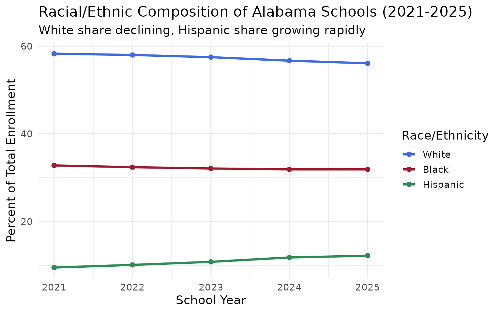
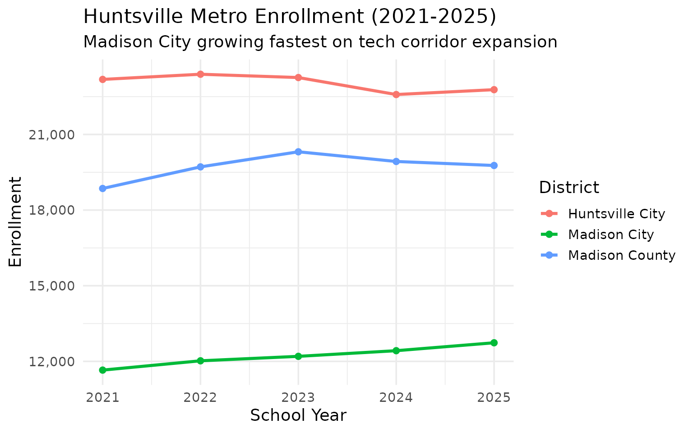
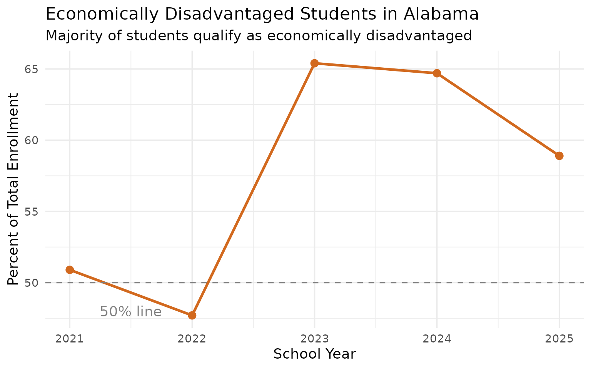
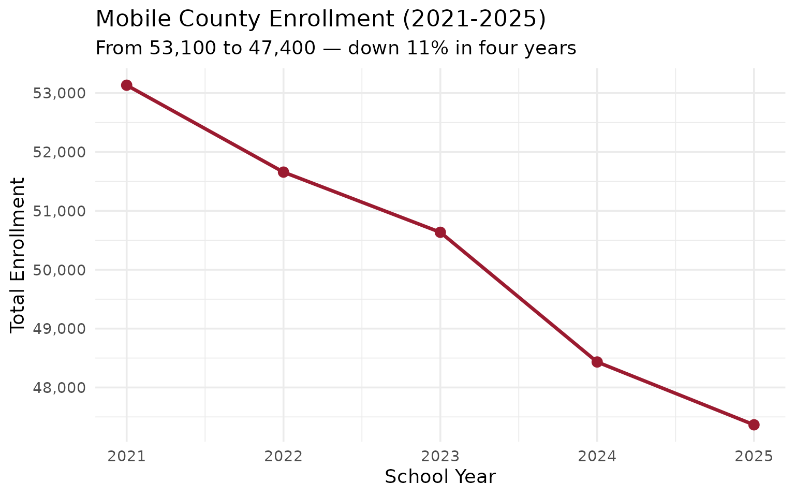
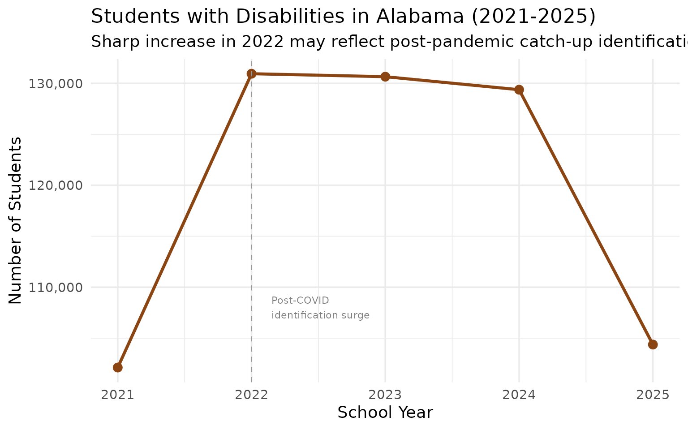
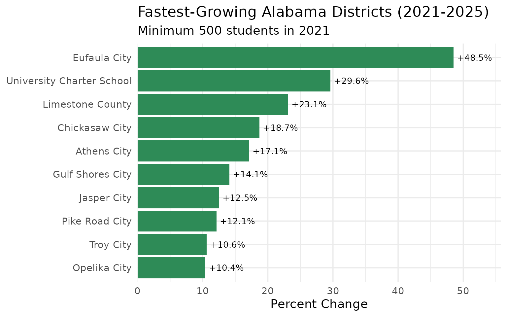
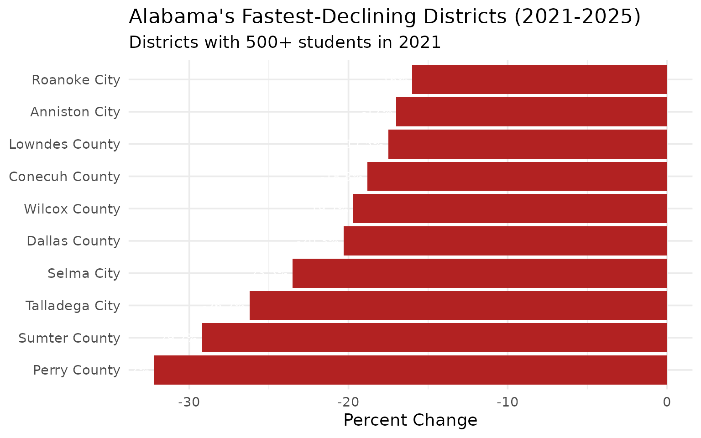

# 15 Insights from Alabama School Enrollment Data

``` r
library(alschooldata)
library(dplyr)
library(tidyr)
library(ggplot2)

theme_set(theme_minimal(base_size = 14))
```

This vignette explores Alabama’s public school enrollment data from the
Alabama State Department of Education (ALSDE), covering the 2021-2025
school years. All data comes directly from the [ALSDE Federal Report
Card](https://reportcard.alsde.edu/).

------------------------------------------------------------------------

## 1. Alabama lost 12,000 students in four years

Despite a post-COVID bounce in 2022, Alabama’s K-12 enrollment has
declined from 730,000 to 717,000 since 2021.

``` r
enr <- fetch_enr_multi(2021:2025, use_cache = TRUE)

state_totals <- enr |>
  filter(is_state, subgroup == "total_enrollment", grade_level == "TOTAL") |>
  select(end_year, n_students) |>
  arrange(end_year) |>
  mutate(change = n_students - lag(n_students),
         pct_change = round(change / lag(n_students) * 100, 1))

stopifnot(nrow(state_totals) > 0)
state_totals
#>   end_year n_students change pct_change
#> 1     2021     729786     NA         NA
#> 2     2022     735808   6022        0.8
#> 3     2023     729789  -6019       -0.8
#> 4     2024     718716 -11073       -1.5
#> 5     2025     717473  -1243       -0.2
```

``` r
ggplot(state_totals, aes(x = end_year, y = n_students)) +
  geom_line(linewidth = 1.2, color = "#9B1B30") +
  geom_point(size = 3, color = "#9B1B30") +
  scale_y_continuous(labels = scales::comma, limits = c(710000, 740000)) +
  scale_x_continuous(breaks = 2021:2025) +
  labs(
    title = "Alabama Public School Enrollment (2021-2025)",
    subtitle = "Post-COVID bounce followed by steady decline",
    x = "School Year (ending)",
    y = "Total Enrollment"
  )
```


------------------------------------------------------------------------

## 2. Hispanic enrollment grew 27% in four years

Hispanic students are the fastest-growing demographic, rising from 9.5%
to 12.2% of enrollment since 2021.

``` r
hispanic_trend <- enr |>
  filter(is_state, subgroup == "hispanic", grade_level == "TOTAL") |>
  mutate(pct = round(pct * 100, 1)) |>
  select(end_year, n_students, pct) |>
  arrange(end_year)

stopifnot(nrow(hispanic_trend) > 0)
hispanic_trend
#>   end_year n_students  pct
#> 1     2021      69093  9.5
#> 2     2022      74561 10.1
#> 3     2023      78638 10.8
#> 4     2024      84661 11.8
#> 5     2025      87790 12.2
```

``` r
ggplot(hispanic_trend, aes(x = end_year, y = n_students)) +
  geom_line(linewidth = 1.2, color = "#2E8B57") +
  geom_point(size = 3, color = "#2E8B57") +
  scale_y_continuous(labels = scales::comma) +
  scale_x_continuous(breaks = 2021:2025) +
  labs(
    title = "Hispanic Student Enrollment in Alabama (2021-2025)",
    subtitle = "From 69,000 to 88,000 students in four years",
    x = "School Year (ending)",
    y = "Number of Hispanic Students"
  )
```


------------------------------------------------------------------------

## 3. Mobile County leads with 47,000 students

Alabama has 153 school systems. Mobile County alone enrolls more than
double the second-largest district.

``` r
enr_2025 <- enr |> filter(end_year == 2025)

top_10 <- enr_2025 |>
  filter(is_district, subgroup == "total_enrollment", grade_level == "TOTAL") |>
  arrange(desc(n_students)) |>
  head(10) |>
  select(district_name, n_students)

stopifnot(nrow(top_10) > 0)
top_10
#>        district_name n_students
#> 1      Mobile County      47366
#> 2   Jefferson County      33844
#> 3     Baldwin County      30491
#> 4  Montgomery County      25491
#> 5    Huntsville City      22776
#> 6      Shelby County      20159
#> 7     Madison County      19769
#> 8    Birmingham City      19710
#> 9  Tuscaloosa County      18135
#> 10  Limestone County      15816
```

``` r
top_10 |>
  mutate(district_name = forcats::fct_reorder(district_name, n_students)) |>
  ggplot(aes(x = n_students, y = district_name)) +
  geom_col(fill = "#9B1B30") +
  scale_x_continuous(labels = scales::comma) +
  labs(
    title = "Alabama's 10 Largest School Systems (2024-25)",
    x = "Total Enrollment",
    y = NULL
  )
```


------------------------------------------------------------------------

## 4. Birmingham shrinks while suburbs hold steady

Birmingham City lost 2,200 students since 2021 while nearby Homewood,
Trussville, and Mountain Brook grew.

``` r
bham_districts <- c("Birmingham City", "Hoover City",
                    "Vestavia Hills City", "Mountain Brook City",
                    "Homewood City", "Trussville City")

bham_area <- enr |>
  filter(is_district, subgroup == "total_enrollment", grade_level == "TOTAL",
         district_name %in% bham_districts) |>
  select(end_year, district_name, n_students) |>
  pivot_wider(names_from = end_year, values_from = n_students,
              values_fn = max)

stopifnot(nrow(bham_area) > 0)
bham_area
#> # A tibble: 6 × 6
#>   district_name       `2021` `2022` `2023` `2024` `2025`
#>   <chr>                <dbl>  <dbl>  <dbl>  <dbl>  <dbl>
#> 1 Birmingham City      21901  21163  19921  19829  19710
#> 2 Homewood City         4185   4199   4319   4360   4419
#> 3 Hoover City          13618  13486  13505  13268  13491
#> 4 Mountain Brook City   4420   4339   4298   4310   4361
#> 5 Trussville City       4770   4888   4941   4915   4949
#> 6 Vestavia Hills City   7003   7107   7063   6847   6845
```

``` r
enr |>
  filter(is_district, subgroup == "total_enrollment", grade_level == "TOTAL",
         district_name %in% bham_districts) |>
  ggplot(aes(x = end_year, y = n_students, color = district_name)) +
  geom_line(linewidth = 1.2) +
  geom_point(size = 2) +
  scale_y_continuous(labels = scales::comma) +
  scale_x_continuous(breaks = 2021:2025) +
  labs(
    title = "Birmingham Metro Enrollment Trends (2021-2025)",
    subtitle = "Birmingham City declines while suburbs grow or hold steady",
    x = "School Year",
    y = "Enrollment",
    color = "District"
  )
```


------------------------------------------------------------------------

## 5. Black Belt lost nearly 1 in 5 students since 2021

Eight Black Belt counties lost 19% of their combined enrollment in just
four years, from 13,100 to 10,600 students.

``` r
bb_counties <- c("Perry County", "Wilcox County", "Greene County",
                 "Sumter County", "Lowndes County", "Macon County",
                 "Dallas County", "Hale County")

bb_trend <- enr |>
  filter(is_district, district_name %in% bb_counties,
         subgroup == "total_enrollment", grade_level == "TOTAL") |>
  group_by(end_year) |>
  summarize(total = sum(n_students), .groups = "drop") |>
  arrange(end_year) |>
  mutate(pct_from_2021 = round((total / first(total) - 1) * 100, 1))

stopifnot(nrow(bb_trend) > 0)
bb_trend
#> # A tibble: 5 × 3
#>   end_year total pct_from_2021
#>      <int> <dbl>         <dbl>
#> 1     2021 13108           0  
#> 2     2022 12308          -6.1
#> 3     2023 11796         -10  
#> 4     2024 10918         -16.7
#> 5     2025 10578         -19.3
```

``` r
ggplot(bb_trend, aes(x = end_year, y = total)) +
  geom_line(linewidth = 1.2, color = "#8B4513") +
  geom_point(size = 3, color = "#8B4513") +
  scale_y_continuous(labels = scales::comma) +
  scale_x_continuous(breaks = 2021:2025) +
  labs(
    title = "Combined Enrollment in 8 Black Belt Counties",
    subtitle = "Down 19% in four years — from 13,100 to 10,600 students",
    x = "School Year",
    y = "Total Enrollment"
  )
```


------------------------------------------------------------------------

## 6. Alabama is 56% white, 32% Black, 12% Hispanic

White students are the majority but their share has dropped from 58% to
56% since 2021 as Hispanic enrollment grows.

``` r
demographics <- enr_2025 |>
  filter(is_state, grade_level == "TOTAL",
         subgroup %in% c("white", "black", "hispanic", "asian",
                         "multiracial", "native_american",
                         "pacific_islander")) |>
  mutate(pct = round(pct * 100, 1)) |>
  select(subgroup, n_students, pct) |>
  arrange(desc(n_students))

stopifnot(nrow(demographics) > 0)
demographics
#>           subgroup n_students  pct
#> 1            white     402422 56.1
#> 2            black     228708 31.9
#> 3         hispanic      87790 12.2
#> 4      multiracial      42305  5.9
#> 5  native_american      30582  4.3
#> 6            asian      11511  1.6
#> 7 pacific_islander       1945  0.3
```

``` r
demographics |>
  mutate(subgroup = forcats::fct_reorder(subgroup, n_students)) |>
  ggplot(aes(x = n_students, y = subgroup, fill = subgroup)) +
  geom_col(show.legend = FALSE) +
  geom_text(aes(label = paste0(pct, "%")), hjust = -0.1, size = 3.5) +
  scale_x_continuous(labels = scales::comma,
                     expand = expansion(mult = c(0, 0.15))) +
  scale_fill_brewer(palette = "Set2") +
  labs(
    title = "Alabama Student Demographics (2024-25)",
    x = "Number of Students",
    y = NULL
  )
```


------------------------------------------------------------------------

## 7. The white share is falling 0.5 points per year

White enrollment dropped from 58.3% in 2021 to 56.1% in 2025 as the
student body diversifies.

``` r
demo_shares <- enr |>
  filter(is_state, grade_level == "TOTAL",
         subgroup %in% c("white", "black", "hispanic")) |>
  mutate(pct = round(pct * 100, 1)) |>
  select(end_year, subgroup, pct) |>
  pivot_wider(names_from = subgroup, values_from = pct) |>
  arrange(end_year)

stopifnot(nrow(demo_shares) > 0)
demo_shares
#> # A tibble: 5 × 4
#>   end_year white black hispanic
#>      <int> <dbl> <dbl>    <dbl>
#> 1     2021  58.3  32.8      9.5
#> 2     2022  58    32.4     10.1
#> 3     2023  57.5  32.1     10.8
#> 4     2024  56.7  31.9     11.8
#> 5     2025  56.1  31.9     12.2
```

``` r
enr |>
  filter(is_state, grade_level == "TOTAL",
         subgroup %in% c("white", "black", "hispanic")) |>
  mutate(pct = round(pct * 100, 1),
         subgroup = factor(subgroup, levels = c("white", "black", "hispanic"),
                          labels = c("White", "Black", "Hispanic"))) |>
  ggplot(aes(x = end_year, y = pct, color = subgroup)) +
  geom_line(linewidth = 1.2) +
  geom_point(size = 2) +
  scale_x_continuous(breaks = 2021:2025) +
  scale_color_manual(values = c("White" = "#4169E1", "Black" = "#9B1B30",
                                "Hispanic" = "#2E8B57")) +
  labs(
    title = "Racial/Ethnic Composition of Alabama Schools (2021-2025)",
    subtitle = "White share declining, Hispanic share growing rapidly",
    x = "School Year",
    y = "Percent of Total Enrollment",
    color = "Race/Ethnicity"
  )
```



------------------------------------------------------------------------

## 8. Madison City grew 9% on Huntsville’s tech boom

The Huntsville metro area is Alabama’s growth engine, with Madison City
adding 1,100 students since 2021.

``` r
madison_area <- enr |>
  filter(is_district, subgroup == "total_enrollment", grade_level == "TOTAL",
         district_name %in% c("Madison City", "Madison County", "Huntsville City")) |>
  select(end_year, district_name, n_students) |>
  pivot_wider(names_from = end_year, values_from = n_students, values_fn = max) |>
  mutate(change = `2025` - `2021`,
         pct_change = round((`2025` / `2021` - 1) * 100, 1))

stopifnot(nrow(madison_area) > 0)
madison_area
#> # A tibble: 3 × 8
#>   district_name   `2021` `2022` `2023` `2024` `2025` change pct_change
#>   <chr>            <dbl>  <dbl>  <dbl>  <dbl>  <dbl>  <dbl>      <dbl>
#> 1 Huntsville City  23183  23388  23257  22583  22776   -407       -1.8
#> 2 Madison City     11653  12022  12199  12423  12737   1084        9.3
#> 3 Madison County   18857  19714  20312  19928  19769    912        4.8
```

``` r
enr |>
  filter(is_district, subgroup == "total_enrollment", grade_level == "TOTAL",
         district_name %in% c("Madison City", "Madison County", "Huntsville City")) |>
  ggplot(aes(x = end_year, y = n_students, color = district_name)) +
  geom_line(linewidth = 1.2) +
  geom_point(size = 2) +
  scale_y_continuous(labels = scales::comma) +
  scale_x_continuous(breaks = 2021:2025) +
  labs(
    title = "Huntsville Metro Enrollment (2021-2025)",
    subtitle = "Madison City growing fastest on tech corridor expansion",
    x = "School Year",
    y = "Enrollment",
    color = "District"
  )
```



------------------------------------------------------------------------

## 9. Nearly 59% of students are economically disadvantaged

Alabama’s poverty rate makes the majority of public school students
eligible for free/reduced lunch.

``` r
econ_trend <- enr |>
  filter(is_state, grade_level == "TOTAL", subgroup == "econ_disadv") |>
  mutate(pct = round(pct * 100, 1)) |>
  select(end_year, n_students, pct) |>
  arrange(end_year)

stopifnot(nrow(econ_trend) > 0)
econ_trend
#>   end_year n_students  pct
#> 1     2021     371737 50.9
#> 2     2022     351049 47.7
#> 3     2023     477329 65.4
#> 4     2024     465245 64.7
#> 5     2025     422645 58.9
```

``` r
ggplot(econ_trend, aes(x = end_year, y = pct)) +
  geom_line(linewidth = 1.2, color = "#D2691E") +
  geom_point(size = 3, color = "#D2691E") +
  geom_hline(yintercept = 50, linetype = "dashed", color = "gray50") +
  annotate("text", x = 2021.5, y = 48, label = "50% line", color = "gray50") +
  scale_x_continuous(breaks = 2021:2025) +
  labs(
    title = "Economically Disadvantaged Students in Alabama",
    subtitle = "Majority of students qualify as economically disadvantaged",
    x = "School Year",
    y = "Percent of Total Enrollment"
  )
```



------------------------------------------------------------------------

## 10. English Learners grew 52% in four years

EL enrollment surged from 33,600 to 51,100 students, the fastest growth
of any subgroup.

``` r
el_trend <- enr |>
  filter(is_state, subgroup == "lep", grade_level == "TOTAL") |>
  mutate(pct = round(pct * 100, 1)) |>
  select(end_year, n_students, pct) |>
  arrange(end_year)

stopifnot(nrow(el_trend) > 0)
el_trend
#>   end_year n_students pct
#> 1     2021      33595 4.6
#> 2     2022      36956 5.0
#> 3     2023      41430 5.7
#> 4     2024      47838 6.7
#> 5     2025      51068 7.1
```

``` r
ggplot(el_trend, aes(x = end_year, y = n_students)) +
  geom_line(linewidth = 1.2, color = "#4169E1") +
  geom_point(size = 3, color = "#4169E1") +
  scale_y_continuous(labels = scales::comma) +
  scale_x_continuous(breaks = 2021:2025) +
  labs(
    title = "English Learner Enrollment in Alabama (2021-2025)",
    subtitle = "From 33,600 to 51,100 students — up 52% in four years",
    x = "School Year",
    y = "Number of EL Students"
  )
```


------------------------------------------------------------------------

## 11. Mobile County lost 5,800 students in four years

Alabama’s largest district is shrinking faster than the state average,
losing 11% of enrollment since 2021.

``` r
mobile_trend <- enr |>
  filter(is_district, district_name == "Mobile County",
         subgroup == "total_enrollment", grade_level == "TOTAL") |>
  select(end_year, n_students) |>
  arrange(end_year) |>
  mutate(pct_from_2021 = round((n_students / first(n_students) - 1) * 100, 1))

stopifnot(nrow(mobile_trend) > 0)
mobile_trend
#>   end_year n_students pct_from_2021
#> 1     2021      53134           0.0
#> 2     2022      51658          -2.8
#> 3     2023      50636          -4.7
#> 4     2024      48433          -8.8
#> 5     2025      47366         -10.9
```

``` r
ggplot(mobile_trend, aes(x = end_year, y = n_students)) +
  geom_line(linewidth = 1.2, color = "#9B1B30") +
  geom_point(size = 3, color = "#9B1B30") +
  scale_y_continuous(labels = scales::comma) +
  scale_x_continuous(breaks = 2021:2025) +
  labs(
    title = "Mobile County Enrollment (2021-2025)",
    subtitle = "From 53,100 to 47,400 — down 11% in four years",
    x = "School Year",
    y = "Total Enrollment"
  )
```



------------------------------------------------------------------------

## 12. Special education enrollment spiked in 2022-2023

The number of students with disabilities jumped from 102,000 to 131,000
in 2022, potentially reflecting expanded identification after pandemic
disruptions.

``` r
sped_trend <- enr |>
  filter(is_state, subgroup == "special_ed", grade_level == "TOTAL") |>
  mutate(pct = round(pct * 100, 1)) |>
  select(end_year, n_students, pct) |>
  arrange(end_year)

stopifnot(nrow(sped_trend) > 0)
sped_trend
#>   end_year n_students  pct
#> 1     2021     102117 14.0
#> 2     2022     130946 17.8
#> 3     2023     130655 17.9
#> 4     2024     129379 18.0
#> 5     2025     104371 14.5
```

``` r
ggplot(sped_trend, aes(x = end_year, y = n_students)) +
  geom_line(linewidth = 1.2, color = "#8B4513") +
  geom_point(size = 3, color = "#8B4513") +
  scale_y_continuous(labels = scales::comma) +
  scale_x_continuous(breaks = 2021:2025) +
  labs(
    title = "Students with Disabilities in Alabama (2021-2025)",
    subtitle = "Sharp increase in 2022 may reflect post-pandemic catch-up identification",
    x = "School Year",
    y = "Number of Students"
  )
```



------------------------------------------------------------------------

## 13. 9th grade is the largest class — 5,800 more than 12th

The “9th grade bulge” reflects retention policies, with 56,600 freshmen
versus 50,800 seniors in 2025.

``` r
grade_dist <- enr_2025 |>
  filter(is_state, subgroup == "total_enrollment",
         grade_level %in% c("PK", "K", "01", "02", "03", "04", "05",
                            "06", "07", "08", "09", "10", "11", "12")) |>
  mutate(grade_level = factor(grade_level,
                              levels = c("PK", "K", "01", "02", "03", "04", "05",
                                        "06", "07", "08", "09", "10", "11", "12"))) |>
  select(grade_level, n_students)

stopifnot(nrow(grade_dist) > 0)
grade_dist
#>    grade_level n_students
#> 1           PK       3746
#> 2            K      55467
#> 3           01      56798
#> 4           02      56515
#> 5           03      57054
#> 6           04      54307
#> 7           05      53653
#> 8           06      53450
#> 9           07      54573
#> 10          08      55053
#> 11          09      56624
#> 12          10      55541
#> 13          11      53178
#> 14          12      50839
```

``` r
ggplot(grade_dist, aes(x = grade_level, y = n_students)) +
  geom_col(fill = "#9B1B30") +
  scale_y_continuous(labels = scales::comma) +
  labs(
    title = "Enrollment by Grade Level (2024-25)",
    subtitle = "9th grade shows the characteristic retention 'bulge'",
    x = "Grade Level",
    y = "Number of Students"
  )
```


------------------------------------------------------------------------

## 14. Eufaula City grew 49% — the fastest in the state

Eufaula City added nearly 3,000 students since 2021, making it the
fastest-growing district by percentage.

``` r
growth <- enr |>
  filter(is_district, subgroup == "total_enrollment", grade_level == "TOTAL",
         end_year %in% c(2021, 2025)) |>
  select(end_year, district_name, n_students) |>
  pivot_wider(names_from = end_year, values_from = n_students,
              values_fn = max) |>
  filter(!is.na(`2021`) & !is.na(`2025`) & `2021` > 500) |>
  mutate(change = `2025` - `2021`,
         pct_change = round((`2025` / `2021` - 1) * 100, 1)) |>
  arrange(desc(pct_change)) |>
  head(10) |>
  select(district_name, `2021`, `2025`, change, pct_change)

stopifnot(nrow(growth) > 0)
growth
#> # A tibble: 10 × 5
#>    district_name             `2021` `2025` change pct_change
#>    <chr>                      <dbl>  <dbl>  <dbl>      <dbl>
#>  1 Eufaula City                6012   8930   2918       48.5
#>  2 University Charter School    503    652    149       29.6
#>  3 Limestone County           12849  15816   2967       23.1
#>  4 Chickasaw City              2771   3289    518       18.7
#>  5 Athens City                 4501   5269    768       17.1
#>  6 Gulf Shores City            2262   2581    319       14.1
#>  7 Jasper City                 2525   2840    315       12.5
#>  8 Pike Road City              2472   2772    300       12.1
#>  9 Troy City                   1646   1820    174       10.6
#> 10 Opelika City                4710   5202    492       10.4
```

``` r
growth |>
  mutate(district_name = forcats::fct_reorder(district_name, pct_change)) |>
  ggplot(aes(x = pct_change, y = district_name)) +
  geom_col(fill = "#2E8B57") +
  geom_text(aes(label = paste0("+", pct_change, "%")), hjust = -0.1, size = 3.5) +
  scale_x_continuous(expand = expansion(mult = c(0, 0.15))) +
  labs(
    title = "Fastest-Growing Alabama Districts (2021-2025)",
    subtitle = "Minimum 500 students in 2021",
    x = "Percent Change",
    y = NULL
  )
```



------------------------------------------------------------------------

## 15. Perry County lost a third of its students

The steepest decline is in Perry County, which dropped from 1,148 to 778
students — a 32% loss since 2021.

``` r
decline <- enr |>
  filter(is_district, subgroup == "total_enrollment", grade_level == "TOTAL",
         end_year %in% c(2021, 2025)) |>
  select(end_year, district_name, n_students) |>
  pivot_wider(names_from = end_year, values_from = n_students,
              values_fn = max) |>
  filter(!is.na(`2021`) & !is.na(`2025`) & `2021` > 500) |>
  mutate(change = `2025` - `2021`,
         pct_change = round((`2025` / `2021` - 1) * 100, 1)) |>
  arrange(pct_change) |>
  head(10) |>
  select(district_name, `2021`, `2025`, change, pct_change)

stopifnot(nrow(decline) > 0)
decline
#> # A tibble: 10 × 5
#>    district_name  `2021` `2025` change pct_change
#>    <chr>           <dbl>  <dbl>  <dbl>      <dbl>
#>  1 Perry County     1148    778   -370      -32.2
#>  2 Sumter County    1202    851   -351      -29.2
#>  3 Talladega City   1837   1356   -481      -26.2
#>  4 Selma City       2776   2124   -652      -23.5
#>  5 Dallas County    2775   2211   -564      -20.3
#>  6 Wilcox County    1404   1127   -277      -19.7
#>  7 Conecuh County   1474   1197   -277      -18.8
#>  8 Lowndes County   1311   1081   -230      -17.5
#>  9 Anniston City    1980   1643   -337      -17  
#> 10 Roanoke City     1475   1239   -236      -16
```

``` r
decline |>
  mutate(district_name = forcats::fct_reorder(district_name, -pct_change)) |>
  ggplot(aes(x = pct_change, y = district_name)) +
  geom_col(fill = "#9B1B30") +
  geom_text(aes(label = paste0(pct_change, "%")), hjust = 1.1, color = "white", size = 3.5) +
  scale_x_continuous(expand = expansion(mult = c(0.05, 0))) +
  labs(
    title = "Fastest-Declining Alabama Districts (2021-2025)",
    subtitle = "Minimum 500 students in 2021",
    x = "Percent Change",
    y = NULL
  )
```



------------------------------------------------------------------------

## Summary

Alabama’s school enrollment data reveals a state in demographic
transition:

- **Overall decline** from 730,000 to 717,000 students since 2021
- **Hispanic growth** is the dominant demographic trend (+27% in 4
  years)
- **English Learner surge** mirrors Hispanic growth (+52% since 2021)
- **Urban-to-suburban shift** continues around Birmingham and Huntsville
- **Black Belt crisis** — rural counties losing 19% of enrollment in 4
  years
- **High poverty** — nearly 59% of students are economically
  disadvantaged

------------------------------------------------------------------------

### Data Notes

- **Source:** Alabama State Department of Education (ALSDE) [Federal
  Report Card](https://reportcard.alsde.edu/)
- **Years available:** 2015-2025 (this analysis uses 2021-2025)
- **Entities:** ~153 school systems, ~1,400 schools
- **Suppression:** Counts below 5 are marked with `*` or `~` to protect
  student privacy
- **Reporting:** Data reflects Census Day enrollment for each school
  year

------------------------------------------------------------------------

*Part of the [state
schooldata](https://github.com/almartin82/njschooldata) project.*

------------------------------------------------------------------------

``` r
sessionInfo()
#> R version 4.5.2 (2025-10-31)
#> Platform: x86_64-pc-linux-gnu
#> Running under: Ubuntu 24.04.3 LTS
#> 
#> Matrix products: default
#> BLAS:   /usr/lib/x86_64-linux-gnu/openblas-pthread/libblas.so.3 
#> LAPACK: /usr/lib/x86_64-linux-gnu/openblas-pthread/libopenblasp-r0.3.26.so;  LAPACK version 3.12.0
#> 
#> locale:
#>  [1] LC_CTYPE=C.UTF-8       LC_NUMERIC=C           LC_TIME=C.UTF-8       
#>  [4] LC_COLLATE=C.UTF-8     LC_MONETARY=C.UTF-8    LC_MESSAGES=C.UTF-8   
#>  [7] LC_PAPER=C.UTF-8       LC_NAME=C              LC_ADDRESS=C          
#> [10] LC_TELEPHONE=C         LC_MEASUREMENT=C.UTF-8 LC_IDENTIFICATION=C   
#> 
#> time zone: UTC
#> tzcode source: system (glibc)
#> 
#> attached base packages:
#> [1] stats     graphics  grDevices utils     datasets  methods   base     
#> 
#> other attached packages:
#> [1] ggplot2_4.0.2      tidyr_1.3.2        dplyr_1.2.0        alschooldata_0.2.0
#> [5] testthat_3.3.2    
#> 
#> loaded via a namespace (and not attached):
#>  [1] utf8_1.2.6         rappdirs_0.3.4     sass_0.4.10        generics_0.1.4    
#>  [5] xml2_1.5.2         stringi_1.8.7      hms_1.1.4          digest_0.6.39     
#>  [9] magrittr_2.0.4     evaluate_1.0.5     grid_4.5.2         RColorBrewer_1.1-3
#> [13] fastmap_1.2.0      jsonlite_2.0.0     brio_1.1.5         httr_1.4.8        
#> [17] rvest_1.0.5        purrr_1.2.1        selectr_0.5-1      scales_1.4.0      
#> [21] codetools_0.2-20   textshaping_1.0.4  jquerylib_0.1.4    cli_3.6.5         
#> [25] crayon_1.5.3       rlang_1.1.7        bit64_4.6.0-1      withr_3.0.2       
#> [29] cachem_1.1.0       yaml_2.3.12        parallel_4.5.2     tools_4.5.2       
#> [33] tzdb_0.5.0         forcats_1.0.1      curl_7.0.0         vctrs_0.7.1       
#> [37] R6_2.6.1           lifecycle_1.0.5    stringr_1.6.0      bit_4.6.0         
#> [41] fs_1.6.6           vroom_1.7.0        ragg_1.5.0         pkgconfig_2.0.3   
#> [45] desc_1.4.3         pkgdown_2.2.0      pillar_1.11.1      bslib_0.10.0      
#> [49] gtable_0.3.6       glue_1.8.0         systemfonts_1.3.1  xfun_0.56         
#> [53] tibble_3.3.1       tidyselect_1.2.1   knitr_1.51         farver_2.1.2      
#> [57] htmltools_0.5.9    labeling_0.4.3     rmarkdown_2.30     readr_2.2.0       
#> [61] compiler_4.5.2     S7_0.2.1
```
