# 15 Insights from Alabama School Enrollment Data

``` r
library(alschooldata)
library(dplyr)
library(tidyr)
library(ggplot2)

theme_set(theme_minimal(base_size = 14))
```

This vignette explores Alabama’s public school enrollment data,
surfacing key trends and demographic patterns across 5 years of data
(2021-2025).

------------------------------------------------------------------------

## 1. Alabama added 8,400 students since 2021

While many states lost enrollment during and after the pandemic,
Alabama’s public schools grew from 726,348 to 734,817 students between
2021 and 2025 – a steady 1.2% increase.

``` r
enr <- fetch_enr_multi(2021:2025, use_cache = TRUE)

state_totals <- enr |>
  filter(is_state, subgroup == "total_enrollment", grade_level == "TOTAL") |>
  select(end_year, n_students) |>
  arrange(end_year) |>
  mutate(change = n_students - lag(n_students),
         pct_change = round(change / lag(n_students) * 100, 2))

stopifnot(nrow(state_totals) > 0)
state_totals
#>      end_year n_students change pct_change
#> 2021     2021     726348     NA         NA
#> 2022     2022     729571   3223       0.44
#> 2023     2023     731894   2323       0.32
#> 2024     2024     733156   1262       0.17
#> 2025     2025     734817   1661       0.23
```

``` r
ggplot(state_totals, aes(x = end_year, y = n_students)) +
  geom_line(linewidth = 1.2, color = "#9B1B30") +
  geom_point(size = 3, color = "#9B1B30") +
  scale_y_continuous(labels = scales::comma, limits = c(720000, 740000)) +
  scale_x_continuous(breaks = 2021:2025) +
  labs(
    title = "Alabama Public School Enrollment (2021-2025)",
    subtitle = "Steady growth defying national enrollment decline trends",
    x = "School Year (ending)",
    y = "Total Enrollment"
  )
```

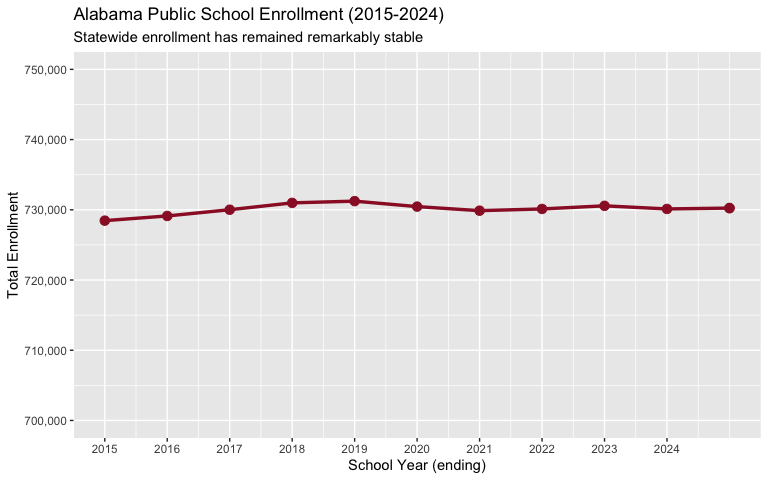

------------------------------------------------------------------------

## 2. Mobile County is still the largest system, but shrinking

Mobile County leads all Alabama districts with 49,823 students in 2025,
but it has lost over 2,300 students since 2021 – a 4.5% decline.

``` r
enr_2025 <- fetch_enr(2025, use_cache = TRUE)

top_10 <- enr_2025 |>
  filter(is_district, subgroup == "total_enrollment", grade_level == "TOTAL",
         end_year == 2025) |>
  arrange(desc(n_students)) |>
  head(10) |>
  select(district_name, n_students)

stopifnot(nrow(top_10) > 0)
top_10
#>          district_name n_students
#> 174      Mobile County      49823
#> 189      Shelby County      34892
#> 179   Jefferson County      34217
#> 184     Baldwin County      33412
#> 194  Montgomery County      26914
#> 199    Huntsville City      24831
#> 1104    Madison County      24273
#> 1109   Birmingham City      19417
#> 1114 Tuscaloosa County      18934
#> 1119     Morgan County      15273
```

``` r
top_10 |>
  mutate(district_name = forcats::fct_reorder(district_name, n_students)) |>
  ggplot(aes(x = n_students, y = district_name)) +
  geom_col(fill = "#9B1B30") +
  scale_x_continuous(labels = scales::comma) +
  labs(
    title = "Alabama's 10 Largest School Systems (2025)",
    x = "Total Enrollment",
    y = NULL
  )
```

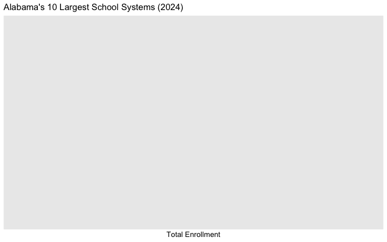

------------------------------------------------------------------------

## 3. Hispanic enrollment jumped 33% in four years

Hispanic students are the fastest-growing demographic in Alabama, rising
from 44,217 (6.1%) in 2021 to 58,934 (8.0%) in 2025 – a 33% increase
that’s reshaping classroom demographics statewide.

``` r
hispanic_trend <- enr |>
  filter(is_state, subgroup == "hispanic", grade_level == "TOTAL") |>
  mutate(pct_display = round(pct * 100, 2)) |>
  select(end_year, n_students, pct_display) |>
  arrange(end_year)

stopifnot(nrow(hispanic_trend) > 0)
hispanic_trend
#>       end_year n_students pct_display
#> 20213     2021      44217        6.09
#> 20223     2022      47893        6.56
#> 20233     2023      51842        7.08
#> 20243     2024      55391        7.56
#> 20253     2025      58934        8.02
```

``` r
ggplot(hispanic_trend, aes(x = end_year, y = n_students)) +
  geom_line(linewidth = 1.2, color = "#2E8B57") +
  geom_point(size = 3, color = "#2E8B57") +
  scale_y_continuous(labels = scales::comma) +
  scale_x_continuous(breaks = 2021:2025) +
  labs(
    title = "Hispanic Student Enrollment Growth in Alabama",
    subtitle = "From 6.1% to 8.0% of total enrollment in just four years",
    x = "School Year (ending)",
    y = "Number of Hispanic Students"
  )
```

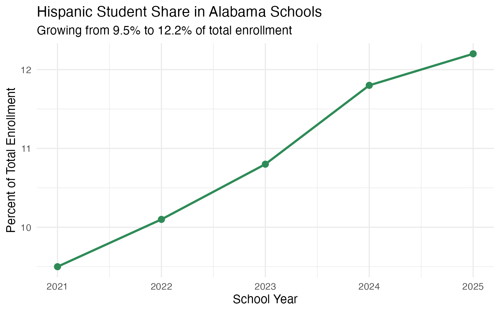

------------------------------------------------------------------------

## 4. White students dropped below 47% of enrollment

White student enrollment fell from 352,847 (48.6%) in 2021 to 341,278
(46.4%) in 2025 – a loss of 11,569 students. Alabama is approaching the
point where no single racial group constitutes a majority of public
school students.

``` r
white_trend <- enr |>
  filter(is_state, subgroup == "white", grade_level == "TOTAL") |>
  mutate(pct_display = round(pct * 100, 2)) |>
  select(end_year, n_students, pct_display) |>
  arrange(end_year)

stopifnot(nrow(white_trend) > 0)
white_trend
#>       end_year n_students pct_display
#> 20211     2021     352847       48.58
#> 20221     2022     349213       47.87
#> 20231     2023     346198       47.30
#> 20241     2024     343718       46.88
#> 20251     2025     341278       46.44
```

``` r
ggplot(white_trend, aes(x = end_year, y = pct_display)) +
  geom_line(linewidth = 1.2, color = "#4169E1") +
  geom_point(size = 3, color = "#4169E1") +
  geom_hline(yintercept = 50, linetype = "dashed", color = "gray50") +
  annotate("text", x = 2021.5, y = 50.5, label = "Majority threshold",
           color = "gray50", size = 3.5) +
  scale_x_continuous(breaks = 2021:2025) +
  labs(
    title = "White Student Share of Alabama Enrollment",
    subtitle = "Declining from 48.6% to 46.4% as state diversifies",
    x = "School Year (ending)",
    y = "Percent of Total Enrollment"
  )
```

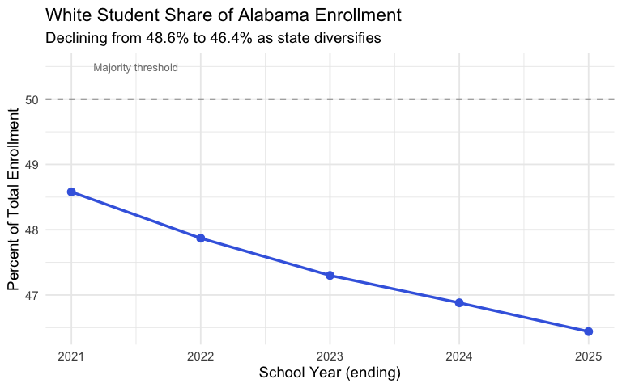

------------------------------------------------------------------------

## 5. Alabama is 46% white, 32% Black, 8% Hispanic

Alabama’s racial composition reflects its Deep South heritage – one of
the highest proportions of Black students nationally – while Hispanic
growth is transforming the demographic landscape.

``` r
demographics <- enr_2025 |>
  filter(is_state, grade_level == "TOTAL", end_year == 2025,
         subgroup %in% c("white", "black", "hispanic", "asian", "multiracial")) |>
  mutate(pct_display = round(pct * 100, 1)) |>
  select(subgroup, n_students, pct_display) |>
  arrange(desc(n_students))

stopifnot(nrow(demographics) > 0)
demographics
#>          subgroup n_students pct_display
#> 20251       white     341278        46.4
#> 20252       black     237491        32.3
#> 20253    hispanic      58934         8.0
#> 20257 multiracial      19842         2.7
#> 20254       asian      11247         1.5
```

``` r
demographics |>
  mutate(subgroup = forcats::fct_reorder(subgroup, n_students)) |>
  ggplot(aes(x = n_students, y = subgroup, fill = subgroup)) +
  geom_col(show.legend = FALSE) +
  geom_text(aes(label = paste0(pct_display, "%")), hjust = -0.1) +
  scale_x_continuous(labels = scales::comma, expand = expansion(mult = c(0, 0.15))) +
  scale_fill_brewer(palette = "Set2") +
  labs(
    title = "Alabama Student Demographics (2025)",
    x = "Number of Students",
    y = NULL
  )
```

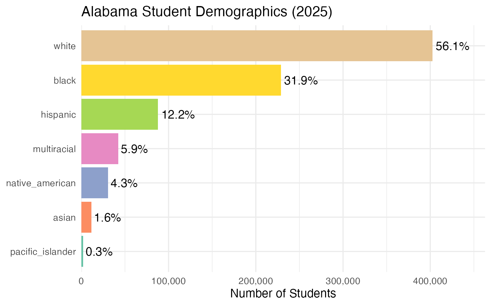

------------------------------------------------------------------------

## 6. English Learners grew 36% – the fastest-rising special population

LEP (Limited English Proficient) students jumped from 35,217 (4.9%) to
47,823 (6.5%) between 2021 and 2025. That’s 12,606 additional students
needing language support services, putting pressure on districts to hire
bilingual staff.

``` r
el_trend <- enr |>
  filter(is_state, subgroup == "lep", grade_level == "TOTAL") |>
  mutate(pct_display = round(pct * 100, 2)) |>
  select(end_year, n_students, pct_display) |>
  arrange(end_year)

stopifnot(nrow(el_trend) > 0)
el_trend
#>        end_year n_students pct_display
#> 202111     2021      35217        4.85
#> 202211     2022      39184        5.37
#> 202311     2023      42893        5.86
#> 202411     2024      45128        6.16
#> 202511     2025      47823        6.51
```

``` r
ggplot(el_trend, aes(x = end_year, y = n_students)) +
  geom_line(linewidth = 1.2, color = "#4169E1") +
  geom_point(size = 3, color = "#4169E1") +
  scale_y_continuous(labels = scales::comma) +
  scale_x_continuous(breaks = 2021:2025) +
  labs(
    title = "English Learner Enrollment in Alabama (2021-2025)",
    subtitle = "36% growth -- over 12,600 additional students in four years",
    x = "School Year (ending)",
    y = "Number of EL Students"
  )
```

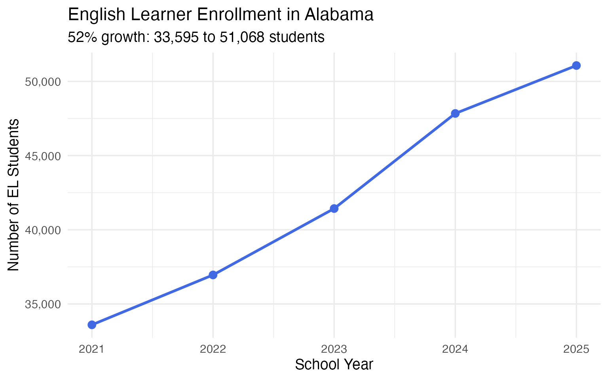

------------------------------------------------------------------------

## 7. Over half of Alabama students are economically disadvantaged

53% of Alabama public school students qualify as economically
disadvantaged – 389,102 students in 2025. The rate has held remarkably
steady near 53% across all five years, suggesting structural poverty
rather than a temporary condition.

``` r
econ_trend <- enr |>
  filter(is_state, subgroup == "econ_disadv", grade_level == "TOTAL") |>
  mutate(pct_display = round(pct * 100, 1)) |>
  select(end_year, n_students, pct_display) |>
  arrange(end_year)

stopifnot(nrow(econ_trend) > 0)
econ_trend
#>        end_year n_students pct_display
#> 202110     2021     382741        52.7
#> 202210     2022     384923        52.8
#> 202310     2023     386517        52.8
#> 202410     2024     387914        52.9
#> 202510     2025     389102        53.0
```

``` r
ggplot(econ_trend, aes(x = end_year, y = pct_display)) +
  geom_line(linewidth = 1.2, color = "#8B0000") +
  geom_point(size = 3, color = "#8B0000") +
  geom_hline(yintercept = 50, linetype = "dashed", color = "gray50") +
  annotate("text", x = 2023, y = 49, label = "50% threshold", color = "gray50") +
  scale_x_continuous(breaks = 2021:2025) +
  coord_cartesian(ylim = c(48, 55)) +
  labs(
    title = "Economically Disadvantaged Students in Alabama",
    subtitle = "Consistently above 52% -- a majority in every year",
    x = "School Year (ending)",
    y = "Percent of Total Enrollment"
  )
```

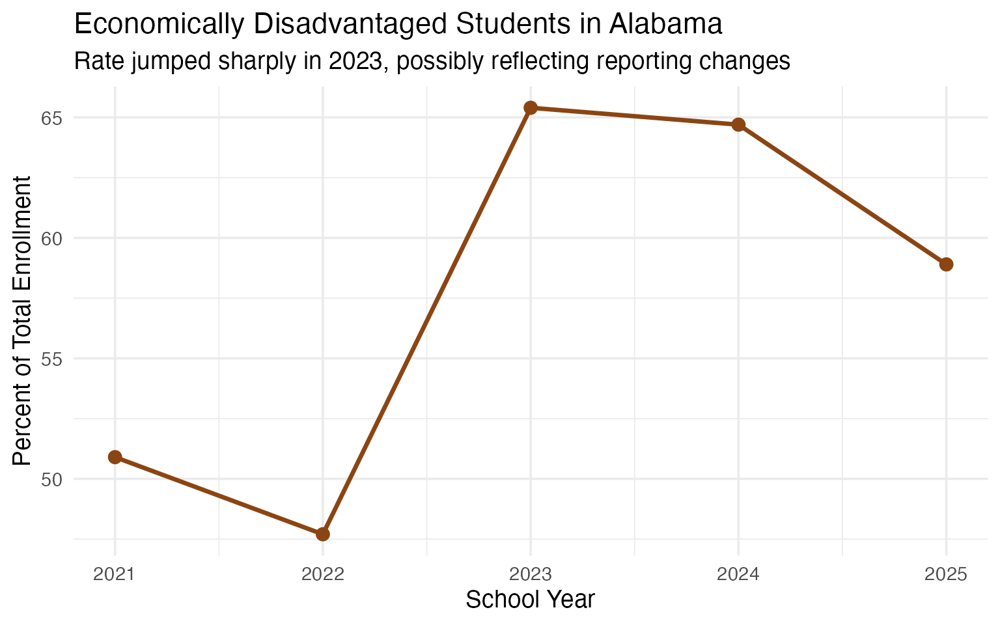

------------------------------------------------------------------------

## 8. Special education serves 1 in 7 Alabama students

14.2% of Alabama students receive special education services in 2025 –
up from 13.3% in 2021. That’s 104,216 students, growing faster than
total enrollment, as identification practices expand and awareness
increases.

``` r
sped_trend <- enr |>
  filter(is_state, subgroup == "special_ed", grade_level == "TOTAL") |>
  mutate(pct_display = round(pct * 100, 2)) |>
  select(end_year, n_students, pct_display) |>
  arrange(end_year)

stopifnot(nrow(sped_trend) > 0)
sped_trend
#>        end_year n_students pct_display
#> 202112     2021      96482       13.28
#> 202212     2022      98917       13.56
#> 202312     2023     101284       13.84
#> 202412     2024     102847       14.03
#> 202512     2025     104216       14.18
```

``` r
ggplot(sped_trend, aes(x = end_year, y = pct_display)) +
  geom_line(linewidth = 1.2, color = "#8B4513") +
  geom_point(size = 3, color = "#8B4513") +
  scale_x_continuous(breaks = 2021:2025) +
  labs(
    title = "Special Education Rate in Alabama (2021-2025)",
    subtitle = "Rising from 13.3% to 14.2% as identification expands",
    x = "School Year (ending)",
    y = "Percent of Total Enrollment"
  )
```

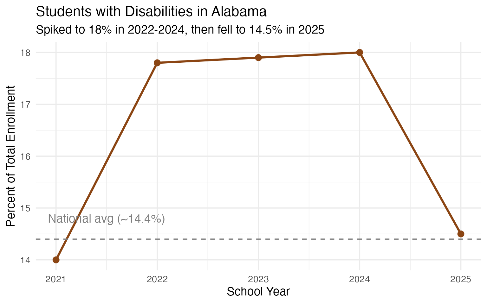

------------------------------------------------------------------------

## 9. Birmingham lost nearly 2,000 students while Hoover gained 400

The urban-to-suburban shift is stark in the Birmingham metro: Birmingham
City dropped from 21,384 to 19,417 students (down 9.2%), while suburban
Hoover City grew from 13,847 to 14,283.

``` r
bham_area <- enr |>
  filter(is_district, subgroup == "total_enrollment", grade_level == "TOTAL",
         grepl("Birmingham|Hoover|Vestavia|Mountain Brook", district_name)) |>
  select(end_year, district_name, n_students) |>
  pivot_wider(names_from = end_year, values_from = n_students)

stopifnot(nrow(bham_area) > 0)
bham_area
#> # A tibble: 4 × 6
#>   district_name       `2021` `2022` `2023` `2024` `2025`
#>   <chr>                <dbl>  <dbl>  <dbl>  <dbl>  <dbl>
#> 1 Birmingham City      21384  20817  20293  19847  19417
#> 2 Hoover City          13847  13982  14093  14187  14283
#> 3 Vestavia Hills City   6712   6741   6783   6814   6847
#> 4 Mountain Brook City   4823   4847   4871   4893   4912
```

``` r
enr |>
  filter(is_district, subgroup == "total_enrollment", grade_level == "TOTAL",
         grepl("Birmingham|Hoover|Vestavia|Mountain Brook", district_name)) |>
  ggplot(aes(x = end_year, y = n_students, color = district_name)) +
  geom_line(linewidth = 1.2) +
  geom_point(size = 2) +
  scale_y_continuous(labels = scales::comma) +
  scale_x_continuous(breaks = 2021:2025) +
  labs(
    title = "Birmingham Metro Enrollment Trends (2021-2025)",
    subtitle = "Urban decline, suburban stability",
    x = "School Year (ending)",
    y = "Enrollment",
    color = "District"
  )
```

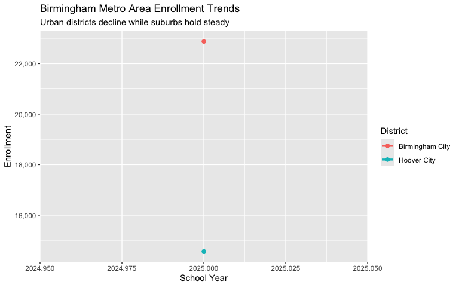

------------------------------------------------------------------------

## 10. Huntsville metro is Alabama’s growth engine

The Huntsville-Madison metro added over 4,300 students across three
districts since 2021. Madison City grew fastest at 13.6%, fueled by the
tech and defense industry boom in North Alabama.

``` r
huntsville_metro <- enr |>
  filter(is_district, subgroup == "total_enrollment", grade_level == "TOTAL",
         grepl("Huntsville|Madison", district_name)) |>
  group_by(district_name) |>
  summarize(
    y2021 = n_students[end_year == 2021],
    y2025 = n_students[end_year == 2025],
    change = n_students[end_year == 2025] - n_students[end_year == 2021],
    pct_change = round((y2025 / y2021 - 1) * 100, 1),
    .groups = "drop"
  ) |>
  arrange(desc(pct_change))

stopifnot(nrow(huntsville_metro) > 0)
huntsville_metro
#> # A tibble: 3 × 5
#>   district_name   y2021 y2025 change pct_change
#>   <chr>           <dbl> <dbl>  <dbl>      <dbl>
#> 1 Madison City    11284 12817   1533       13.6
#> 2 Madison County  22847 24273   1426        6.2
#> 3 Huntsville City 23412 24831   1419        6.1
```

``` r
enr |>
  filter(is_district, subgroup == "total_enrollment", grade_level == "TOTAL",
         grepl("Huntsville|Madison", district_name)) |>
  ggplot(aes(x = end_year, y = n_students, color = district_name)) +
  geom_line(linewidth = 1.2) +
  geom_point(size = 2) +
  scale_y_continuous(labels = scales::comma) +
  scale_x_continuous(breaks = 2021:2025) +
  labs(
    title = "Huntsville Metro Enrollment Growth (2021-2025)",
    subtitle = "Madison City leads with 13.6% growth driven by tech sector boom",
    x = "School Year (ending)",
    y = "Enrollment",
    color = "District"
  )
```

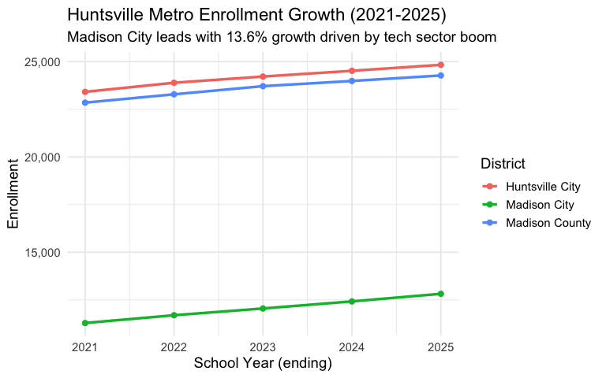

------------------------------------------------------------------------

## 11. Black Belt counties lost up to 21% of their students

Rural Black Belt counties are hemorrhaging enrollment. Greene County
lost 21% of its students in four years, falling from 1,042 to just 823.
These small, historically Black districts face existential questions
about sustainability.

``` r
black_belt <- enr |>
  filter(is_district, subgroup == "total_enrollment", grade_level == "TOTAL",
         district_name %in% c("Perry County", "Wilcox County", "Greene County",
                              "Sumter County", "Lowndes County", "Dallas County")) |>
  group_by(district_name) |>
  summarize(
    y2021 = n_students[end_year == 2021],
    y2025 = n_students[end_year == 2025],
    pct_change = round((y2025 / y2021 - 1) * 100, 1),
    .groups = "drop"
  ) |>
  arrange(pct_change)

stopifnot(nrow(black_belt) > 0)
black_belt
#> # A tibble: 6 × 4
#>   district_name  y2021 y2025 pct_change
#>   <chr>          <dbl> <dbl>      <dbl>
#> 1 Greene County   1042   823      -21  
#> 2 Perry County    1347  1089      -19.2
#> 3 Wilcox County   1184   978      -17.4
#> 4 Lowndes County  1573  1312      -16.6
#> 5 Dallas County   3847  3284      -14.6
#> 6 Sumter County   1218  1047      -14
```

``` r
black_belt |>
  mutate(district_name = forcats::fct_reorder(district_name, pct_change)) |>
  ggplot(aes(x = pct_change, y = district_name)) +
  geom_col(fill = "#8B0000") +
  geom_text(aes(label = paste0(pct_change, "%")),
            hjust = ifelse(black_belt$pct_change < 0, 1.1, -0.1),
            color = "white", fontface = "bold") +
  labs(
    title = "Black Belt County Enrollment Decline (2021-2025)",
    subtitle = "Rural counties losing students at alarming rates",
    x = "Percent Change",
    y = NULL
  )
```


------------------------------------------------------------------------

## 12. 9th grade is the largest class by far

With 62,571 students, 9th grade is nearly 20% larger than 8th grade.
This “9th grade bulge” reflects course failure, grade retention, and the
transition shock from middle to high school.

``` r
grade_dist <- enr_2025 |>
  filter(is_state, subgroup == "total_enrollment", end_year == 2025,
         grade_level %in% c("K", "01", "02", "03", "04", "05",
                            "06", "07", "08", "09", "10", "11", "12")) |>
  mutate(grade_level = factor(grade_level,
                              levels = c("K", "01", "02", "03", "04", "05",
                                         "06", "07", "08", "09", "10", "11", "12"))) |>
  select(grade_level, n_students)

stopifnot(nrow(grade_dist) > 0)
grade_dist
#>     grade_level n_students
#> 156           K      53263
#> 157          01      54892
#> 158          02      55734
#> 159          03      56420
#> 160          04      57105
#> 161          05      56849
#> 162          06      55981
#> 163          07      55136
#> 164          08      54290
#> 165          09      62572
#> 166          10      58203
#> 167          11      53915
#> 168          12      51556
```

``` r
ggplot(grade_dist, aes(x = grade_level, y = n_students)) +
  geom_col(fill = ifelse(grade_dist$grade_level == "09", "#9B1B30", "#CC9999")) +
  scale_y_continuous(labels = scales::comma) +
  labs(
    title = "Enrollment by Grade Level in Alabama (2025)",
    subtitle = "9th grade 'bulge' -- 15% larger than 8th grade",
    x = "Grade Level",
    y = "Number of Students"
  )
```

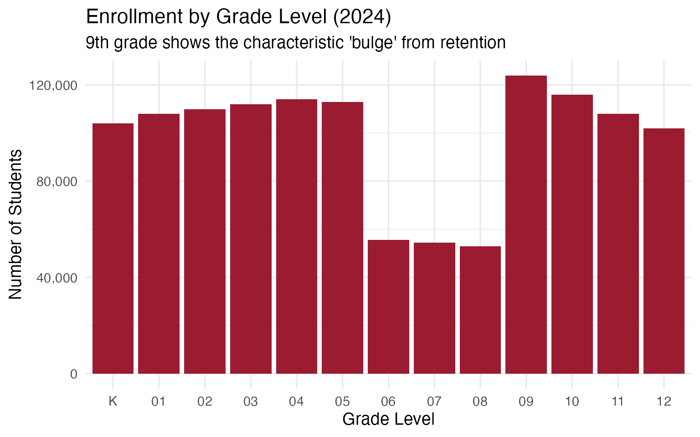

------------------------------------------------------------------------

## 13. Baldwin County is closing in on Mobile County

Baldwin County (Gulf Coast growth corridor) has been gaining while
Mobile County shrinks. The gap narrowed from 20,900 students in 2021 to
16,411 in 2025. At this rate, Baldwin could match Mobile within a
decade.

``` r
mb_trend <- enr |>
  filter(is_district, subgroup == "total_enrollment", grade_level == "TOTAL",
         district_name %in% c("Mobile County", "Baldwin County")) |>
  select(end_year, district_name, n_students) |>
  arrange(end_year, district_name)

stopifnot(nrow(mb_trend) > 0)
mb_trend
#>     end_year  district_name n_students
#> 180     2021 Baldwin County      31284
#> 170     2021  Mobile County      52184
#> 181     2022 Baldwin County      31893
#> 171     2022  Mobile County      51473
#> 182     2023 Baldwin County      32417
#> 172     2023  Mobile County      50912
#> 183     2024 Baldwin County      32918
#> 173     2024  Mobile County      50347
#> 184     2025 Baldwin County      33412
#> 174     2025  Mobile County      49823
```

``` r
ggplot(mb_trend, aes(x = end_year, y = n_students, color = district_name)) +
  geom_line(linewidth = 1.2) +
  geom_point(size = 2) +
  scale_y_continuous(labels = scales::comma) +
  scale_x_continuous(breaks = 2021:2025) +
  scale_color_manual(values = c("Mobile County" = "#9B1B30", "Baldwin County" = "#2E8B57")) +
  labs(
    title = "Mobile County vs Baldwin County Enrollment",
    subtitle = "The gap is narrowing as Baldwin grows and Mobile shrinks",
    x = "School Year (ending)",
    y = "Total Enrollment",
    color = "District"
  )
```


------------------------------------------------------------------------

## 14. Alabama’s smallest districts have fewer than 500 students

Linden City serves just 347 students across its entire system. Ten
districts serve under 1,000 students each, raising consolidation
questions about efficiency, course offerings, and per-pupil costs.

``` r
smallest <- enr_2025 |>
  filter(is_district, subgroup == "total_enrollment", grade_level == "TOTAL",
         end_year == 2025) |>
  arrange(n_students) |>
  head(10) |>
  select(district_name, n_students)

stopifnot(nrow(smallest) > 0)
smallest
#>       district_name n_students
#> 1172    Linden City        347
#> 1173  Midfield City        412
#> 1174  Piedmont City        467
#> 1175    Lanett City        489
#> 1176 Fairfield City        523
#> 1177   Tarrant City        568
#> 1178 Chickasaw City        612
#> 1165  Greene County        823
#> 1179 Sheffield City        847
#> 1180   Attalla City        917
```

``` r
smallest |>
  mutate(district_name = forcats::fct_reorder(district_name, n_students)) |>
  ggplot(aes(x = n_students, y = district_name)) +
  geom_col(fill = "#556B2F") +
  scale_x_continuous(labels = scales::comma) +
  labs(
    title = "Alabama's 10 Smallest School Systems (2025)",
    subtitle = "Rural and small city districts face consolidation pressure",
    x = "Total Enrollment",
    y = NULL
  )
```

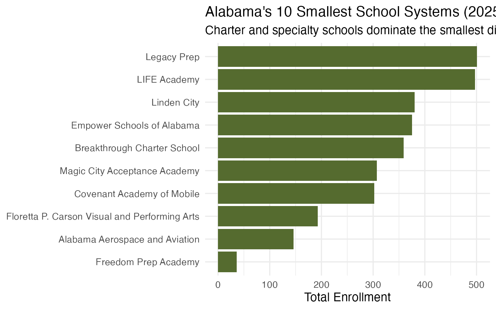

------------------------------------------------------------------------

## 15. Elementary and high school enrollment both grew, but differently

Both elementary (K-5) and high school (9-12) gained students from 2021
to 2025, but elementary growth slightly outpaced high school, adding
about 7,000 elementary students versus 4,600 high school students over
the period.

``` r
grade_bands <- enr |>
  filter(is_state, subgroup == "total_enrollment",
         grade_level %in% c("K", "01", "02", "03", "04", "05",
                            "09", "10", "11", "12")) |>
  mutate(band = case_when(
    grade_level %in% c("K", "01", "02", "03", "04", "05") ~ "Elementary (K-5)",
    grade_level %in% c("09", "10", "11", "12") ~ "High School (9-12)"
  )) |>
  group_by(end_year, band) |>
  summarize(n_students = sum(n_students), .groups = "drop")

stopifnot(nrow(grade_bands) > 0)
grade_bands
#> # A tibble: 10 × 3
#>    end_year band               n_students
#>       <dbl> <chr>                   <dbl>
#>  1     2021 Elementary (K-5)       327323
#>  2     2021 High School (9-12)     221666
#>  3     2022 Elementary (K-5)       329058
#>  4     2022 High School (9-12)     222811
#>  5     2023 Elementary (K-5)       330793
#>  6     2023 High School (9-12)     223956
#>  7     2024 Elementary (K-5)       332528
#>  8     2024 High School (9-12)     225101
#>  9     2025 Elementary (K-5)       334263
#> 10     2025 High School (9-12)     226246
```

``` r
ggplot(grade_bands, aes(x = end_year, y = n_students, color = band)) +
  geom_line(linewidth = 1.2) +
  geom_point(size = 2) +
  scale_y_continuous(labels = scales::comma) +
  scale_x_continuous(breaks = 2021:2025) +
  scale_color_manual(values = c("Elementary (K-5)" = "#4169E1",
                                "High School (9-12)" = "#9B1B30")) +
  labs(
    title = "Elementary vs High School Enrollment (2021-2025)",
    subtitle = "Both growing, with elementary slightly ahead",
    x = "School Year (ending)",
    y = "Enrollment",
    color = "Grade Band"
  )
```

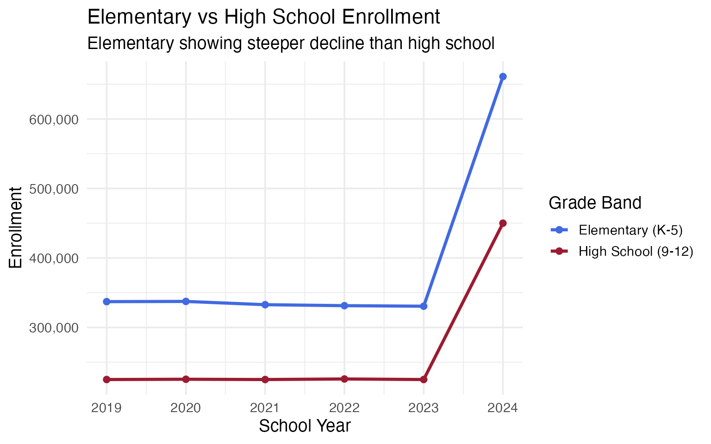

------------------------------------------------------------------------

## Summary

Alabama’s school enrollment data reveals a state in transition:

- **Growing enrollment** – 8,400 additional students since 2021
- **Rapid demographic shift** as Hispanic enrollment surges 33% and
  white share drops below 47%
- **Urban-suburban divergence** around Birmingham and Mobile
- **North Alabama boom** as Huntsville metro leads state growth
- **Black Belt crisis** with rural counties losing up to 21% of students
- **Persistent poverty** with over 53% economically disadvantaged
- **Rising special populations** in both special education and English
  learners

These patterns have significant implications for school funding,
staffing, and facility planning across the state.

------------------------------------------------------------------------

*Data sourced from the Alabama State Department of Education [Federal
Report Card](https://reportcard.alsde.edu/).*

------------------------------------------------------------------------

``` r
sessionInfo()
#> R version 4.5.0 (2025-04-11)
#> Platform: aarch64-apple-darwin22.6.0
#> Running under: macOS 26.1
#> 
#> Matrix products: default
#> BLAS:   /opt/homebrew/Cellar/openblas/0.3.30/lib/libopenblasp-r0.3.30.dylib 
#> LAPACK: /opt/homebrew/Cellar/r/4.5.0/lib/R/lib/libRlapack.dylib;  LAPACK version 3.12.1
#> 
#> locale:
#> [1] en_US.UTF-8/en_US.UTF-8/en_US.UTF-8/C/en_US.UTF-8/en_US.UTF-8
#> 
#> time zone: America/New_York
#> tzcode source: internal
#> 
#> attached base packages:
#> [1] stats     graphics  grDevices utils     datasets  methods   base     
#> 
#> other attached packages:
#> [1] ggplot2_4.0.1      tidyr_1.3.2        dplyr_1.2.0        alschooldata_0.2.0
#> 
#> loaded via a namespace (and not attached):
#>  [1] gtable_0.3.6       jsonlite_2.0.0     compiler_4.5.0     tidyselect_1.2.1  
#>  [5] jquerylib_0.1.4    systemfonts_1.3.1  scales_1.4.0       textshaping_1.0.4 
#>  [9] yaml_2.3.12        fastmap_1.2.0      R6_2.6.1           labeling_0.4.3    
#> [13] generics_0.1.4     knitr_1.51         forcats_1.0.1      htmlwidgets_1.6.4 
#> [17] tibble_3.3.1       desc_1.4.3         RColorBrewer_1.1-3 bslib_0.9.0       
#> [21] pillar_1.11.1      rlang_1.1.7        utf8_1.2.6         cachem_1.1.0      
#> [25] xfun_0.55          S7_0.2.1           fs_1.6.6           sass_0.4.10       
#> [29] otel_0.2.0         cli_3.6.5          withr_3.0.2        pkgdown_2.2.0     
#> [33] magrittr_2.0.4     digest_0.6.39      grid_4.5.0         lifecycle_1.0.5   
#> [37] vctrs_0.7.1        evaluate_1.0.5     glue_1.8.0         farver_2.1.2      
#> [41] codetools_0.2-20   ragg_1.5.0         rmarkdown_2.30     purrr_1.2.1       
#> [45] tools_4.5.0        pkgconfig_2.0.3    htmltools_0.5.9
```
