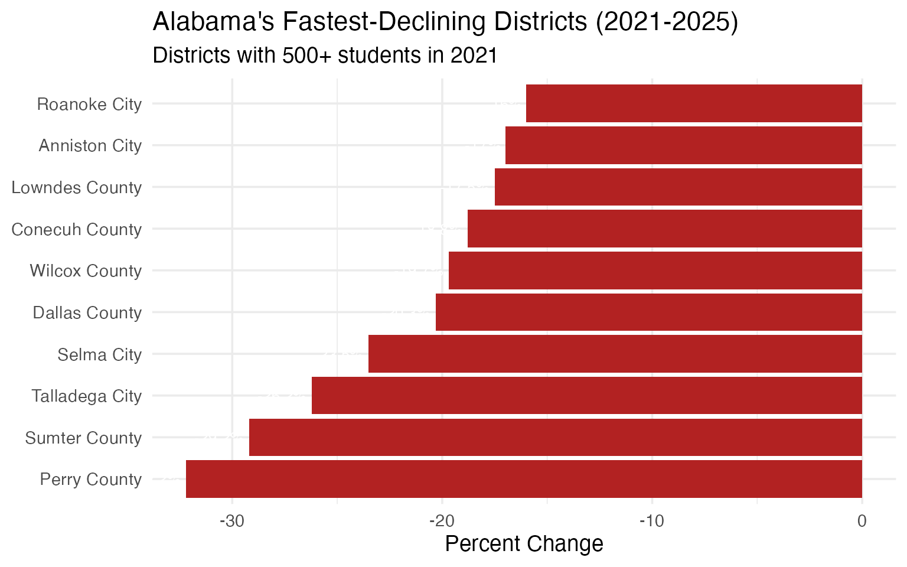
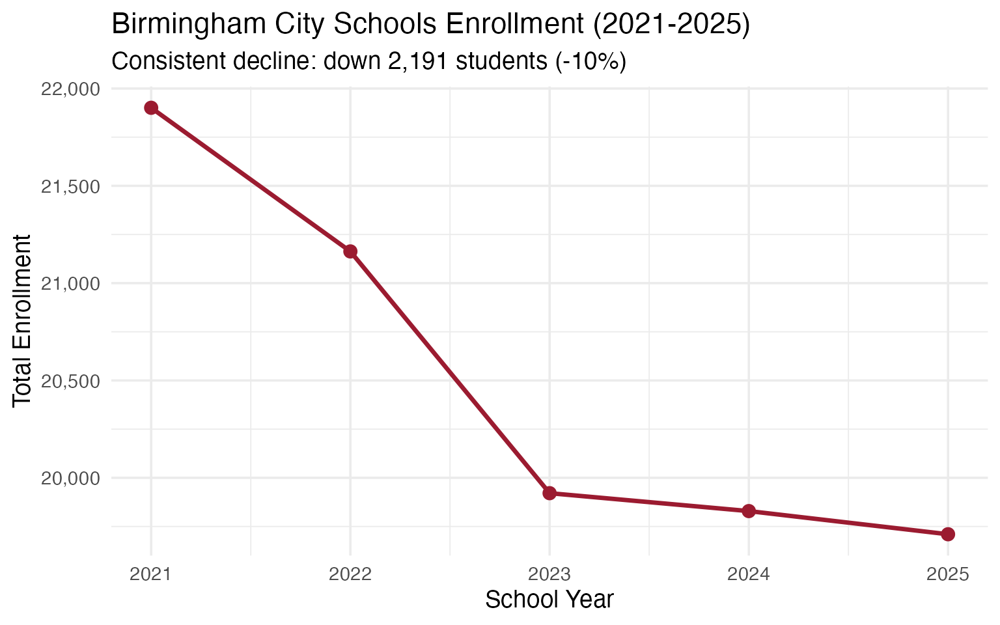
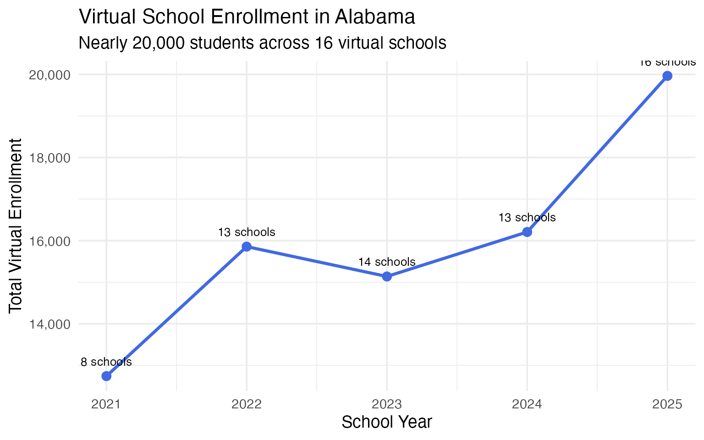
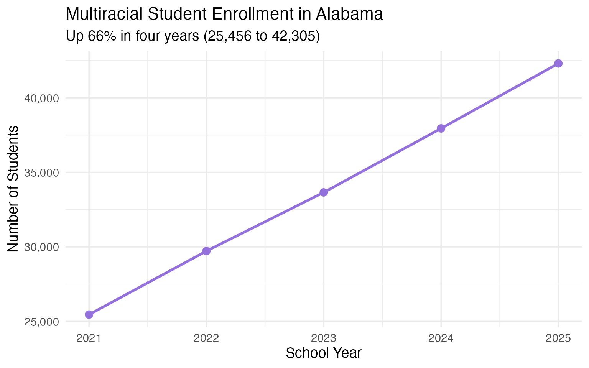

# 15 Insights from Alabama School Enrollment Data

``` r
library(alschooldata)
library(dplyr)
library(tidyr)
library(ggplot2)

theme_set(theme_minimal(base_size = 14))
```

This vignette explores Alabama’s public school enrollment data from the
Alabama State Department of Education (ALSDE), covering 5 years
(2021-2025) of campus-level data across 153 districts and 1,362 schools.

------------------------------------------------------------------------

## 1. Alabama lost 12,000 students since 2022

Statewide enrollment peaked at 735,808 in 2022 and has since declined by
over 18,000 students. The 2024 drop of 11,073 was the steepest
single-year decline.

``` r
enr <- fetch_enr_multi(2021:2025, use_cache = TRUE)

state_totals <- enr |>
  filter(is_state, subgroup == "total_enrollment", grade_level == "TOTAL") |>
  select(end_year, n_students) |>
  arrange(end_year) |>
  mutate(change = n_students - lag(n_students),
         pct_change = round(change / lag(n_students) * 100, 2))

stopifnot(nrow(state_totals) > 0)
state_totals
#>   end_year n_students change pct_change
#> 1     2021     729786     NA         NA
#> 2     2022     735808   6022       0.83
#> 3     2023     729789  -6019      -0.82
#> 4     2024     718716 -11073      -1.52
#> 5     2025     717473  -1243      -0.17
```

``` r
ggplot(state_totals, aes(x = end_year, y = n_students)) +
  geom_line(linewidth = 1.2, color = "#9B1B30") +
  geom_point(size = 3, color = "#9B1B30") +
  scale_y_continuous(labels = scales::comma, limits = c(710000, 740000)) +
  scale_x_continuous(breaks = 2021:2025) +
  labs(
    title = "Alabama Public School Enrollment (2021-2025)",
    subtitle = "Enrollment peaked in 2022 and has declined since",
    x = "School Year (ending)",
    y = "Total Enrollment"
  )
```


------------------------------------------------------------------------

## 2. Hispanic enrollment surged from 9.5% to 12.2% in four years

Hispanic students are the fastest-growing racial/ethnic group in Alabama
schools, adding nearly 19,000 students since 2021 while overall
enrollment declined.

``` r
hispanic <- enr |>
  filter(is_state, subgroup == "hispanic", grade_level == "TOTAL") |>
  mutate(pct = round(pct * 100, 1)) |>
  select(end_year, n_students, pct) |>
  arrange(end_year)

stopifnot(nrow(hispanic) > 0)
hispanic
#>   end_year n_students  pct
#> 1     2021      69093  9.5
#> 2     2022      74561 10.1
#> 3     2023      78638 10.8
#> 4     2024      84661 11.8
#> 5     2025      87790 12.2
```

``` r
ggplot(hispanic, aes(x = end_year, y = pct)) +
  geom_line(linewidth = 1.2, color = "#2E8B57") +
  geom_point(size = 3, color = "#2E8B57") +
  scale_x_continuous(breaks = 2021:2025) +
  labs(
    title = "Hispanic Student Share in Alabama Schools",
    subtitle = "Growing from 9.5% to 12.2% of total enrollment",
    x = "School Year",
    y = "Percent of Total Enrollment"
  )
```


------------------------------------------------------------------------

## 3. Mobile County is Alabama’s largest system – and shrinking fastest

Mobile County Public Schools serves 47,366 students, nearly 14,000 more
than second-place Jefferson County. But Mobile has lost 5,768 students
since 2021, a decline of 10.9%.

``` r
enr_2025 <- enr |> filter(end_year == 2025)

top_10 <- enr_2025 |>
  filter(is_district, subgroup == "total_enrollment", grade_level == "TOTAL") |>
  arrange(desc(n_students)) |>
  head(10) |>
  select(district_name, n_students)

stopifnot(nrow(top_10) > 0)
top_10
#>        district_name n_students
#> 1      Mobile County      47366
#> 2   Jefferson County      33844
#> 3     Baldwin County      30491
#> 4  Montgomery County      25491
#> 5    Huntsville City      22776
#> 6      Shelby County      20159
#> 7     Madison County      19769
#> 8    Birmingham City      19710
#> 9  Tuscaloosa County      18135
#> 10  Limestone County      15816
```

``` r
top_10 |>
  mutate(district_name = forcats::fct_reorder(district_name, n_students)) |>
  ggplot(aes(x = n_students, y = district_name)) +
  geom_col(fill = "#9B1B30") +
  scale_x_continuous(labels = scales::comma) +
  labs(
    title = "Alabama's 10 Largest School Systems (2025)",
    x = "Total Enrollment",
    y = NULL
  )
```


------------------------------------------------------------------------

## 4. Black Belt counties are hemorrhaging students

Perry County has lost 32% of its enrollment since 2021 – the steepest
decline of any Alabama district with 500+ students. Sumter County lost
29%, and Selma City lost 24%.

``` r
decline <- enr |>
  filter(is_district, subgroup == "total_enrollment", grade_level == "TOTAL",
         end_year %in% c(2021, 2025)) |>
  select(end_year, district_name, n_students) |>
  pivot_wider(names_from = end_year, values_from = n_students) |>
  filter(!is.na(`2021`), !is.na(`2025`), `2021` >= 500) |>
  mutate(change = `2025` - `2021`,
         pct_change = round((`2025` / `2021` - 1) * 100, 1)) |>
  arrange(pct_change) |>
  head(10)

stopifnot(nrow(decline) > 0)
decline
#> # A tibble: 10 × 5
#>    district_name  `2021` `2025` change pct_change
#>    <chr>           <dbl>  <dbl>  <dbl>      <dbl>
#>  1 Perry County     1148    778   -370      -32.2
#>  2 Sumter County    1202    851   -351      -29.2
#>  3 Talladega City   1837   1356   -481      -26.2
#>  4 Selma City       2776   2124   -652      -23.5
#>  5 Dallas County    2775   2211   -564      -20.3
#>  6 Wilcox County    1404   1127   -277      -19.7
#>  7 Conecuh County   1474   1197   -277      -18.8
#>  8 Lowndes County   1311   1081   -230      -17.5
#>  9 Anniston City    1980   1643   -337      -17  
#> 10 Roanoke City     1475   1239   -236      -16
```

``` r
decline |>
  mutate(district_name = forcats::fct_reorder(district_name, pct_change)) |>
  ggplot(aes(x = pct_change, y = district_name)) +
  geom_col(fill = "#B22222") +
  geom_text(aes(label = paste0(pct_change, "%")), hjust = 1.1, color = "white", size = 3.5) +
  labs(
    title = "Alabama's Fastest-Declining Districts (2021-2025)",
    subtitle = "Districts with 500+ students in 2021",
    x = "Percent Change",
    y = NULL
  )
```



------------------------------------------------------------------------

## 5. Alabama’s student body: 56% white, 32% Black, 12% Hispanic

Alabama’s racial demographics are shifting. White students still form
the majority but their share dropped from 58.3% to 56.1% since 2021,
while Hispanic and multiracial shares both grew.

``` r
demographics <- enr_2025 |>
  filter(is_state, grade_level == "TOTAL",
         subgroup %in% c("white", "black", "hispanic", "asian",
                         "native_american", "pacific_islander", "multiracial")) |>
  mutate(pct = round(pct * 100, 1)) |>
  select(subgroup, n_students, pct) |>
  arrange(desc(n_students))

stopifnot(nrow(demographics) > 0)
demographics
#>           subgroup n_students  pct
#> 1            white     402422 56.1
#> 2            black     228708 31.9
#> 3         hispanic      87790 12.2
#> 4      multiracial      42305  5.9
#> 5  native_american      30582  4.3
#> 6            asian      11511  1.6
#> 7 pacific_islander       1945  0.3
```

``` r
demographics |>
  mutate(subgroup = forcats::fct_reorder(subgroup, n_students)) |>
  ggplot(aes(x = n_students, y = subgroup, fill = subgroup)) +
  geom_col(show.legend = FALSE) +
  geom_text(aes(label = paste0(pct, "%")), hjust = -0.1) +
  scale_x_continuous(labels = scales::comma, expand = expansion(mult = c(0, 0.15))) +
  scale_fill_brewer(palette = "Set2") +
  labs(
    title = "Alabama Student Demographics (2025)",
    x = "Number of Students",
    y = NULL
  )
```


------------------------------------------------------------------------

## 6. Nearly 3 in 5 Alabama students are economically disadvantaged

The economically disadvantaged rate jumped from 51% in 2021 to 65% in
2023, then settled at 59% in 2025. This volatility may reflect changes
in reporting methodology rather than true poverty shifts.

``` r
econ <- enr |>
  filter(is_state, grade_level == "TOTAL", subgroup == "econ_disadv") |>
  mutate(pct = round(pct * 100, 1)) |>
  select(end_year, n_students, pct) |>
  arrange(end_year)

stopifnot(nrow(econ) > 0)
econ
#>   end_year n_students  pct
#> 1     2021     371737 50.9
#> 2     2022     351049 47.7
#> 3     2023     477329 65.4
#> 4     2024     465245 64.7
#> 5     2025     422645 58.9
```

``` r
ggplot(econ, aes(x = end_year, y = pct)) +
  geom_line(linewidth = 1.2, color = "#8B4513") +
  geom_point(size = 3, color = "#8B4513") +
  scale_x_continuous(breaks = 2021:2025) +
  labs(
    title = "Economically Disadvantaged Students in Alabama",
    subtitle = "Rate jumped sharply in 2023, possibly reflecting reporting changes",
    x = "School Year",
    y = "Percent of Total Enrollment"
  )
```


------------------------------------------------------------------------

## 7. Birmingham City lost 2,191 students in four years

Birmingham City Schools has shed students every single year since 2021,
dropping from 21,901 to 19,710 – a 10% decline. Once a top-5 Alabama
district, it now ranks 8th.

``` r
bham <- enr |>
  filter(is_district, subgroup == "total_enrollment", grade_level == "TOTAL",
         grepl("Birmingham City", district_name)) |>
  select(end_year, n_students) |>
  arrange(end_year) |>
  mutate(change = n_students - lag(n_students))

stopifnot(nrow(bham) > 0)
bham
#>   end_year n_students change
#> 1     2021      21901     NA
#> 2     2022      21163   -738
#> 3     2023      19921  -1242
#> 4     2024      19829    -92
#> 5     2025      19710   -119
```

``` r
ggplot(bham, aes(x = end_year, y = n_students)) +
  geom_line(linewidth = 1.2, color = "#9B1B30") +
  geom_point(size = 3, color = "#9B1B30") +
  scale_y_continuous(labels = scales::comma) +
  scale_x_continuous(breaks = 2021:2025) +
  labs(
    title = "Birmingham City Schools Enrollment (2021-2025)",
    subtitle = "Consistent decline: down 2,191 students (-10%)",
    x = "School Year",
    y = "Total Enrollment"
  )
```



------------------------------------------------------------------------

## 8. Virtual schools exploded to 20,000 students

Alabama’s virtual schools grew from 12,741 students (8 schools) in 2021
to 19,963 students (16 schools) in 2025. Alabama Connections Academy
alone enrolls 7,339, making Limestone County appear to be one of the
state’s largest districts.

``` r
virtual <- enr |>
  filter(is_campus, subgroup == "total_enrollment", grade_level == "TOTAL",
         grepl("Virtual|Connections|Destinations", campus_name, ignore.case = TRUE)) |>
  group_by(end_year) |>
  summarize(n_schools = n(), total_students = sum(n_students), .groups = "drop") |>
  arrange(end_year)

stopifnot(nrow(virtual) > 0)
virtual
#> # A tibble: 5 × 3
#>   end_year n_schools total_students
#>      <dbl>     <int>          <dbl>
#> 1     2021         8          12741
#> 2     2022        13          15856
#> 3     2023        14          15138
#> 4     2024        13          16207
#> 5     2025        16          19963
```

``` r
ggplot(virtual, aes(x = end_year, y = total_students)) +
  geom_line(linewidth = 1.2, color = "#4169E1") +
  geom_point(size = 3, color = "#4169E1") +
  geom_text(aes(label = paste0(n_schools, " schools")), vjust = -1.2, size = 3.5) +
  scale_y_continuous(labels = scales::comma) +
  scale_x_continuous(breaks = 2021:2025) +
  labs(
    title = "Virtual School Enrollment in Alabama",
    subtitle = "Nearly 20,000 students across 16 virtual schools",
    x = "School Year",
    y = "Total Virtual Enrollment"
  )
```



------------------------------------------------------------------------

## 9. Multiracial students are the fastest-growing demographic

Students identifying as multiracial grew from 25,456 (3.5%) to 42,305
(5.9%) since 2021 – a 66% increase. At this pace, multiracial students
will outnumber Asian and Native American students combined.

``` r
multi <- enr |>
  filter(is_state, subgroup == "multiracial", grade_level == "TOTAL") |>
  mutate(pct = round(pct * 100, 1)) |>
  select(end_year, n_students, pct) |>
  arrange(end_year)

stopifnot(nrow(multi) > 0)
multi
#>   end_year n_students pct
#> 1     2021      25456 3.5
#> 2     2022      29716 4.0
#> 3     2023      33651 4.6
#> 4     2024      37946 5.3
#> 5     2025      42305 5.9
```

``` r
ggplot(multi, aes(x = end_year, y = n_students)) +
  geom_line(linewidth = 1.2, color = "#9370DB") +
  geom_point(size = 3, color = "#9370DB") +
  scale_y_continuous(labels = scales::comma) +
  scale_x_continuous(breaks = 2021:2025) +
  labs(
    title = "Multiracial Student Enrollment in Alabama",
    subtitle = "Up 66% in four years (25,456 to 42,305)",
    x = "School Year",
    y = "Number of Students"
  )
```



------------------------------------------------------------------------

## 10. English Learners grew 52% in four years

Alabama’s English Learner population surged from 33,595 (4.6%) to 51,068
(7.1%), closely tracking the growth in Hispanic enrollment and
reflecting the state’s demographic transformation.

``` r
el_trend <- enr |>
  filter(is_state, subgroup == "lep", grade_level == "TOTAL") |>
  mutate(pct = round(pct * 100, 1)) |>
  select(end_year, n_students, pct) |>
  arrange(end_year)

stopifnot(nrow(el_trend) > 0)
el_trend
#>   end_year n_students pct
#> 1     2021      33595 4.6
#> 2     2022      36956 5.0
#> 3     2023      41430 5.7
#> 4     2024      47838 6.7
#> 5     2025      51068 7.1
```

``` r
ggplot(el_trend, aes(x = end_year, y = n_students)) +
  geom_line(linewidth = 1.2, color = "#4169E1") +
  geom_point(size = 3, color = "#4169E1") +
  scale_y_continuous(labels = scales::comma) +
  scale_x_continuous(breaks = 2021:2025) +
  labs(
    title = "English Learner Enrollment in Alabama",
    subtitle = "52% growth: 33,595 to 51,068 students",
    x = "School Year",
    y = "Number of EL Students"
  )
```


------------------------------------------------------------------------

## 11. Special Ed spiked to 18% then fell back to 14.5%

Special education enrollment jumped from 14% to 18% between 2021 and
2024, then dropped to 14.5% in 2025. The spike may reflect expanded
eligibility or pandemic-related identification, with the recent decline
suggesting a correction.

``` r
sped <- enr |>
  filter(is_state, subgroup == "special_ed", grade_level == "TOTAL") |>
  mutate(pct = round(pct * 100, 1)) |>
  select(end_year, n_students, pct) |>
  arrange(end_year)

stopifnot(nrow(sped) > 0)
sped
#>   end_year n_students  pct
#> 1     2021     102117 14.0
#> 2     2022     130946 17.8
#> 3     2023     130655 17.9
#> 4     2024     129379 18.0
#> 5     2025     104371 14.5
```

``` r
ggplot(sped, aes(x = end_year, y = pct)) +
  geom_line(linewidth = 1.2, color = "#8B4513") +
  geom_point(size = 3, color = "#8B4513") +
  geom_hline(yintercept = 14.4, linetype = "dashed", color = "gray50") +
  annotate("text", x = 2021.5, y = 14.8, label = "National avg (~14.4%)", color = "gray50") +
  scale_x_continuous(breaks = 2021:2025) +
  labs(
    title = "Students with Disabilities in Alabama",
    subtitle = "Spiked to 18% in 2022-2024, then fell to 14.5% in 2025",
    x = "School Year",
    y = "Percent of Total Enrollment"
  )
```


------------------------------------------------------------------------

## 12. 3rd grade is the largest class in Alabama

With 57,054 students, 3rd grade edges out 1st grade (56,798) and
kindergarten (55,467) as the most enrolled grade level in 2025.

``` r
grade_dist <- enr_2025 |>
  filter(is_state, subgroup == "total_enrollment",
         grade_level %in% c("K", "01", "02", "03", "04", "05",
                            "06", "07", "08", "09", "10", "11", "12")) |>
  mutate(grade_level = factor(grade_level,
                              levels = c("K", "01", "02", "03", "04", "05",
                                        "06", "07", "08", "09", "10", "11", "12"))) |>
  select(grade_level, n_students) |>
  arrange(grade_level)

stopifnot(nrow(grade_dist) > 0)
grade_dist
#>    grade_level n_students
#> 1            K      55467
#> 2           01      56798
#> 3           02      56515
#> 4           03      57054
#> 5           04      54307
#> 6           05      53653
#> 7           06      53450
#> 8           07      54573
#> 9           08      55053
#> 10          09      56624
#> 11          10      55541
#> 12          11      53178
#> 13          12      50839
```

``` r
ggplot(grade_dist, aes(x = grade_level, y = n_students)) +
  geom_col(fill = "#9B1B30") +
  geom_col(data = grade_dist |> filter(grade_level == "03"),
           fill = "#FF6347") +
  scale_y_continuous(labels = scales::comma) +
  labs(
    title = "Enrollment by Grade Level (2025)",
    subtitle = "3rd grade has the most students; 12th grade has the fewest",
    x = "Grade Level",
    y = "Number of Students"
  )
```


------------------------------------------------------------------------

## 13. Mobile County: 73% low-income, 51% Black

Mobile County’s demographics are dramatically different from statewide
averages. Its economically disadvantaged rate (73%) is 14 points above
the state average, and its Black student population (51%) is 19 points
above the statewide share.

``` r
mobile_demo <- enr_2025 |>
  filter(is_district, grade_level == "TOTAL",
         grepl("Mobile County", district_name),
         subgroup %in% c("white", "black", "hispanic",
                         "econ_disadv", "total_enrollment")) |>
  mutate(pct = round(pct * 100, 1)) |>
  select(subgroup, n_students, pct) |>
  arrange(desc(n_students))

stopifnot(nrow(mobile_demo) > 0)
mobile_demo
#>           subgroup n_students   pct
#> 1 total_enrollment      47366 100.0
#> 2      econ_disadv      34569  73.0
#> 3            black      24070  50.8
#> 4            white      17525  37.0
#> 5         hispanic       3262   6.9
```

------------------------------------------------------------------------

## 14. Charter schools are Alabama’s smallest districts

Alabama’s charter sector is small but growing. The smallest 10 districts
by enrollment are dominated by charter and specialty schools, with
Freedom Prep Academy enrolling just 36 students.

``` r
smallest <- enr_2025 |>
  filter(is_district, subgroup == "total_enrollment", grade_level == "TOTAL") |>
  arrange(n_students) |>
  head(10) |>
  select(district_name, n_students)

stopifnot(nrow(smallest) > 0)
smallest
#>                                    district_name n_students
#> 1                           Freedom Prep Academy         36
#> 2                 Alabama Aerospace and Aviation        146
#> 3  Floretta P. Carson Visual and Performing Arts        193
#> 4                     Covenant Academy of Mobile        302
#> 5                  Magic City Acceptance Academy        307
#> 6                    Breakthrough Charter School        359
#> 7                     Empower Schools of Alabama        375
#> 8                                    Linden City        380
#> 9                                   LIFE Academy        497
#> 10                                   Legacy Prep        501
```

``` r
smallest |>
  mutate(district_name = forcats::fct_reorder(district_name, n_students)) |>
  ggplot(aes(x = n_students, y = district_name)) +
  geom_col(fill = "#556B2F") +
  scale_x_continuous(labels = scales::comma) +
  labs(
    title = "Alabama's 10 Smallest School Systems (2025)",
    subtitle = "Charter and specialty schools dominate the smallest districts",
    x = "Total Enrollment",
    y = NULL
  )
```


------------------------------------------------------------------------

## 15. Middle school enrollment is shrinking while elementary grows

Elementary (K-5) and high school (9-12) enrollment both grew since 2021,
but middle school (6-8) dropped from 173,548 to 163,076 – a loss of over
10,000 students.

``` r
grade_bands <- enr |>
  filter(is_state, subgroup == "total_enrollment",
         grade_level %in% c("K", "01", "02", "03", "04", "05",
                            "06", "07", "08",
                            "09", "10", "11", "12")) |>
  mutate(band = case_when(
    grade_level %in% c("K", "01", "02", "03", "04", "05") ~ "Elementary (K-5)",
    grade_level %in% c("06", "07", "08") ~ "Middle (6-8)",
    grade_level %in% c("09", "10", "11", "12") ~ "High School (9-12)"
  )) |>
  group_by(end_year, band) |>
  summarize(n_students = sum(n_students), .groups = "drop")

stopifnot(nrow(grade_bands) > 0)
grade_bands
#> # A tibble: 15 × 3
#>    end_year band               n_students
#>       <dbl> <chr>                   <dbl>
#>  1     2021 Elementary (K-5)       327017
#>  2     2021 High School (9-12)     211750
#>  3     2021 Middle (6-8)           173548
#>  4     2022 Elementary (K-5)       329002
#>  5     2022 High School (9-12)     212460
#>  6     2022 Middle (6-8)           171009
#>  7     2023 Elementary (K-5)       330453
#>  8     2023 High School (9-12)     213639
#>  9     2023 Middle (6-8)           167263
#> 10     2024 Elementary (K-5)       332704
#> 11     2024 High School (9-12)     216257
#> 12     2024 Middle (6-8)           165208
#> 13     2025 Elementary (K-5)       333794
#> 14     2025 High School (9-12)     216182
#> 15     2025 Middle (6-8)           163076
```

``` r
ggplot(grade_bands, aes(x = end_year, y = n_students, color = band)) +
  geom_line(linewidth = 1.2) +
  geom_point(size = 2) +
  scale_y_continuous(labels = scales::comma) +
  scale_color_manual(values = c("Elementary (K-5)" = "#4169E1",
                                 "Middle (6-8)" = "#2E8B57",
                                 "High School (9-12)" = "#9B1B30")) +
  scale_x_continuous(breaks = 2021:2025) +
  labs(
    title = "Enrollment by Grade Band (2021-2025)",
    subtitle = "Middle school enrollment fell by 10,000 while elementary grew",
    x = "School Year",
    y = "Enrollment",
    color = "Grade Band"
  )
```


------------------------------------------------------------------------

## Summary

Alabama’s school enrollment data reveals a state in rapid transition:

- **Declining overall enrollment** masks dramatic shifts underneath
- **Hispanic and multiracial growth** is reshaping Alabama’s student
  demographics
- **Virtual school explosion** from 12,741 to 19,963 students
- **Black Belt collapse** with Perry County losing 32% of students in 4
  years
- **Birmingham City** dropped from top-5 to 8th-largest district
- **Mobile County** still largest but lost 5,768 students since 2021

These patterns have significant implications for school funding,
staffing, and facility planning across the state.

------------------------------------------------------------------------

*Data sourced from the Alabama State Department of Education [Federal
Report Card](https://www.alsde.edu/).*

------------------------------------------------------------------------

``` r
sessionInfo()
#> R version 4.5.0 (2025-04-11)
#> Platform: aarch64-apple-darwin22.6.0
#> Running under: macOS 26.1
#> 
#> Matrix products: default
#> BLAS:   /opt/homebrew/Cellar/openblas/0.3.30/lib/libopenblasp-r0.3.30.dylib 
#> LAPACK: /opt/homebrew/Cellar/r/4.5.0/lib/R/lib/libRlapack.dylib;  LAPACK version 3.12.1
#> 
#> locale:
#> [1] en_US.UTF-8/en_US.UTF-8/en_US.UTF-8/C/en_US.UTF-8/en_US.UTF-8
#> 
#> time zone: America/New_York
#> tzcode source: internal
#> 
#> attached base packages:
#> [1] stats     graphics  grDevices utils     datasets  methods   base     
#> 
#> other attached packages:
#> [1] ggplot2_4.0.1      tidyr_1.3.2        dplyr_1.2.0        alschooldata_0.2.0
#> 
#> loaded via a namespace (and not attached):
#>  [1] gtable_0.3.6       jsonlite_2.0.0     compiler_4.5.0     tidyselect_1.2.1  
#>  [5] jquerylib_0.1.4    systemfonts_1.3.1  scales_1.4.0       textshaping_1.0.4 
#>  [9] yaml_2.3.12        fastmap_1.2.0      R6_2.6.1           labeling_0.4.3    
#> [13] generics_0.1.4     knitr_1.51         forcats_1.0.1      htmlwidgets_1.6.4 
#> [17] tibble_3.3.1       desc_1.4.3         RColorBrewer_1.1-3 bslib_0.9.0       
#> [21] pillar_1.11.1      rlang_1.1.7        utf8_1.2.6         cachem_1.1.0      
#> [25] xfun_0.55          S7_0.2.1           fs_1.6.6           sass_0.4.10       
#> [29] otel_0.2.0         cli_3.6.5          withr_3.0.2        pkgdown_2.2.0     
#> [33] magrittr_2.0.4     digest_0.6.39      grid_4.5.0         rappdirs_0.3.4    
#> [37] lifecycle_1.0.5    vctrs_0.7.1        evaluate_1.0.5     glue_1.8.0        
#> [41] farver_2.1.2       codetools_0.2-20   ragg_1.5.0         rmarkdown_2.30    
#> [45] purrr_1.2.1        tools_4.5.0        pkgconfig_2.0.3    htmltools_0.5.9
```
